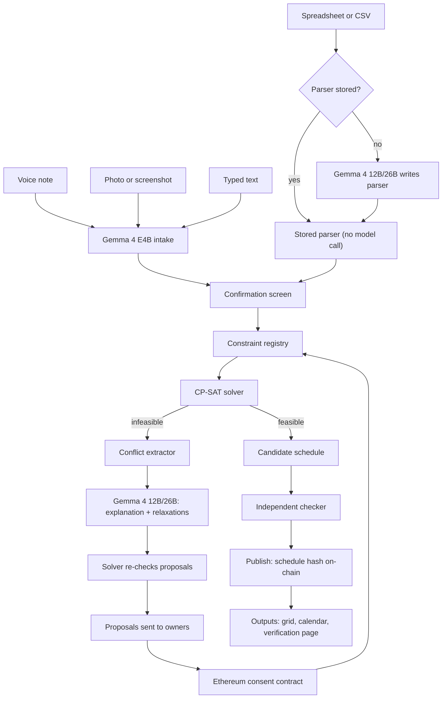
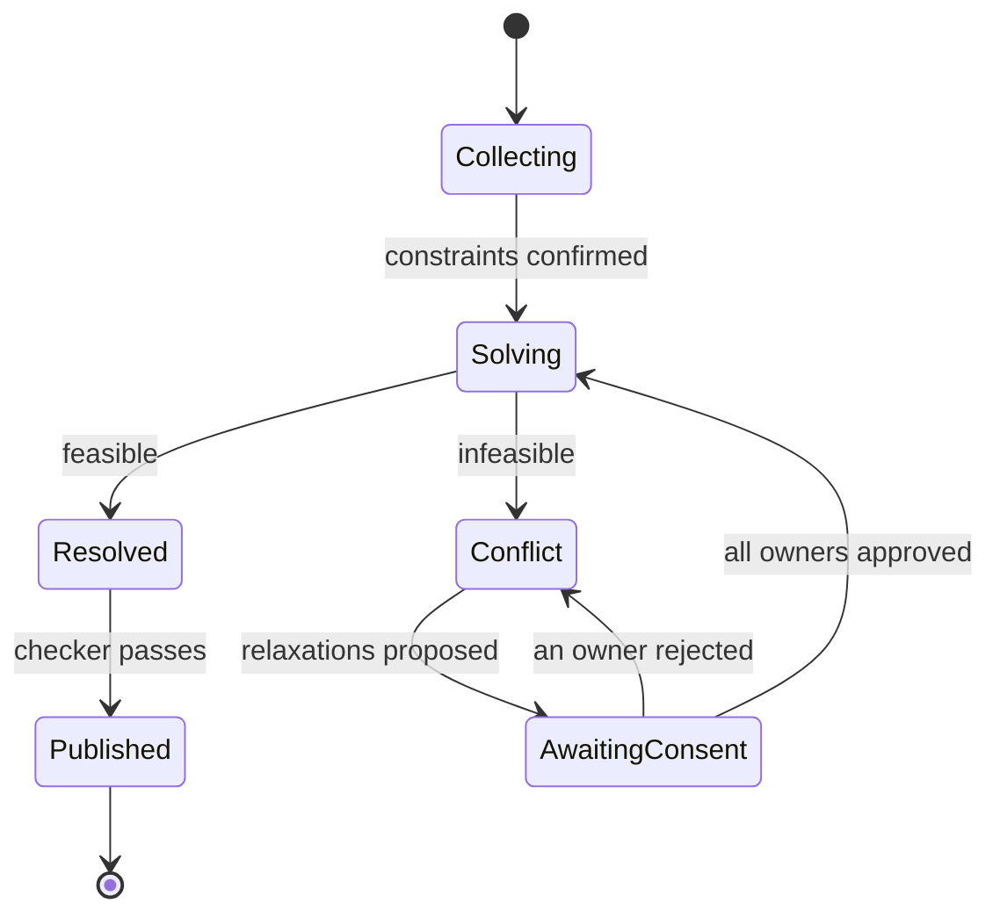
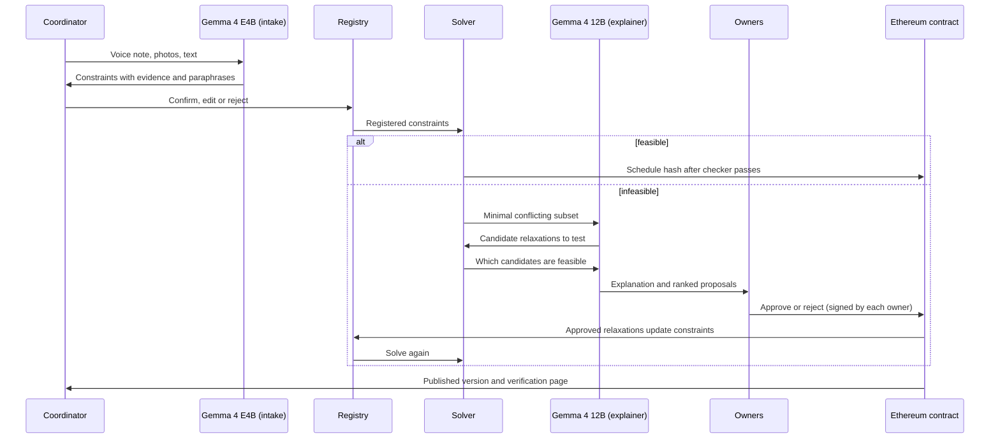

# Sanyojan

**A consent-aware scheduler where Gemma 4 listens, reads and explains, a solver decides, and Ethereum records who agreed.**
Hacktober Fest Open Source AI Hackathon | Track 2: Best Use of Gemma 4

> **One line:** Tell Sanyojan your scheduling rules by voice note, photo, spreadsheet or text. A constraint solver builds a schedule that meets every hard rule. When the rules clash, Gemma 4 explains the clash in plain language, names exactly who is affected, and only those people can approve the fix, which is recorded on Ethereum.

---

## 1. Project Name

**Sanyojan** (Sanskrit/Hindi for "coordination" or "arrangement"): Multimodal, Consent-Aware Scheduling with Gemma 4.

---

## 2. Problem Statement

Timetables, duty rosters, exam invigilation lists and shared-lab bookings are still built by a coordinator juggling spreadsheets. Four problems keep repeating:

1. **Scattered formats.** Constraints live in WhatsApp voice notes, handwritten forms, photos of old timetables, and spreadsheets with varying layouts. Re-mapping all of it into a tool introduces mistakes.
2. **Unexplained failures.** When rules cannot all be met, tools report "no solution" or silently drop a rule without naming *which* rules clash or *who* owns them.
3. **No tamper-proof consent record.** Disputes follow schedule changes ("I never agreed to Saturday"). Chat messages and spreadsheet edits can be lost or rewritten by the same coordinator whose conduct is disputed.
4. **LLMs cannot guarantee valid schedules.** A language model asked to produce a timetable directly can violate stated rules. A solver produces schedules that meet hard rules by construction.

Additionally, availability data is personal—people do not want it uploaded to third-party cloud services.

---

## 3. Project Overview & Solution

Sanyojan converts voice, photo, spreadsheet and text input into a verified schedule, and turns every infeasibility into an approval request sent to the owners of the clashing rules.

### Separation of Duties

| Who | Does what | Never does |
|---|---|---|
| **Gemma 4** | Understands voice, photos and text; writes parsers for new spreadsheet layouts; explains conflicts; proposes fixes | Place classes in slots, certify schedules, or approve changes |
| **Solver (OR-Tools CP-SAT)** | Finds valid schedules; pinpoints minimal clashing rule sets; re-checks every proposed fix | Interpret human language |
| **Ethereum (`ConsentLedger`)** | Stores constraint ownership and hashes; accepts approvals only from owners; records published schedule hashes | Hold funds, store personal data, or verify schedule correctness |

### Flow

1. **Intake:** Coordinator speaks, uploads photos/screenshots, uploads spreadsheets (.xlsx/.csv), or types. Gemma 4 converts all inputs into structured constraint objects, each linked to its source (audio timestamp, image region, text span, or spreadsheet cell). For new spreadsheet layouts, Gemma 4 writes a parser once; the stored parser handles later files without model calls.
2. **Confirm:** Every extracted constraint is shown next to its source evidence with a plain-language paraphrase, confirmed by a human before it counts.
3. **Solve:** The solver builds a schedule or reports infeasibility.
4. **Explain:** If infeasible, the solver returns the minimal conflicting subset. Gemma 4 explains it and proposes ranked relaxations, each re-checked by the solver.
5. **Consent:** Each relaxation goes to the owner of the affected rule. They approve or reject on-chain.
6. **Publish:** Once consent is complete and the independent checker finds zero violations, the schedule hash is published on-chain.

Everything AI-related runs locally on open weights.

### Solution Layers

| Layer | What it does |
|---|---|
| Multimodal intake | Gemma 4 converts voice, images and text into constraint objects via function calling |
| Format adapter (parser synthesis) | Gemma 4 writes and tests a Python parser per new spreadsheet layout; stored parsers handle repeat layouts with zero model tokens |
| Confirmation screen | Shows each constraint beside its source evidence and paraphrase |
| Constraint registry | Stores each constraint with owner, type (hard/soft), and salted hash |
| Solver (CP-SAT) | Builds schedules guaranteeing hard rules |
| Conflict extractor | Finds minimal conflicting rule subsets |
| Gemma 4 explainer | Explains conflicts and ranks relaxations |
| Consent contract | Enforces owner-only approval with append-only history |
| Publisher and verifier | Exports grid/calendar files; verification page compares file hash against on-chain value |
| Evaluation harness | Measures extraction accuracy, rule violations, and explanation quality |

---

## 4. Objectives

- Accept scheduling rules through **voice, image and text** with one open model family.
- Parse spreadsheets with **stored, tested parsers**—a layout needs a model call only once.
- Guarantee **zero hard-rule violations** in every published schedule.
- When infeasible, **name the exact clashing rules and their owners** and propose solver-verified fixes.
- Make every change **consent-based and auditable** on-chain.
- Keep personal data **private**: local inference, only salted hashes on-chain.
- Run on **modest hardware** (laptop-class GPU for the small tier).
- Accept mixed **Hindi, Marathi and English** speech with per-language accuracy reporting.
- Ship a **reproducible evaluation** under Apache 2.0.

---

## 5. Target Users / Use Case

| User | Need |
|---|---|
| College timetable cells and department coordinators | Build and revise class timetables from scattered inputs |
| Exam cells | Invigilation duties and seating plans with fairness and conflict rules |
| Shared-lab and inter-college resource managers | Booking among parties who do not fully trust one administrator |
| Hostels, NGOs and volunteer groups | Duty rosters collected over chat and voice notes |
| Event organizers (hackathons, fests) | Session and room schedules with speaker availability |

**Core use case:** A coordinator dictates rules in Hindi and English, uploads a photo of last year's timetable and the room list, and gets a verified schedule. When two rules clash, their owners receive a plain-language explanation and approve a fix.

---

## 6. Open-Source AI Technology Selected

**Primary model family: Google Gemma 4** (open weights, **Apache 2.0**).

Per the official model card, Gemma 4 comes in five sizes (**E2B, E4B, 12B, 26B A4B, 31B**) with context windows of 128K–256K tokens. All handle text and image input; audio is supported on E2B, E4B and 12B. The family offers thinking mode, native function calling, and 140+ language support.

| Role in Sanyojan | Variant | Reason |
|---|---|---|
| **Intake:** voice, image and text → constraints | **E4B**, 4-bit quantized (~4.5 GB) | Handles audio, image and text in one model |
| **Reasoning:** conflict explanation, relaxation ranking, parser writing | **12B** or **26B A4B** (~6.7–14.4 GB at 4-bit) | Stronger reasoning and code generation |

**Supporting components** (see Section 13 for full stack): OR-Tools CP-SAT, Pydantic, pandas/openpyxl, container sandbox, Foundry/OpenZeppelin, web3.py or ethers.js, Streamlit or Gradio.

*Note: exact checkpoint names and memory figures will be re-confirmed against the official model card at the start of the final.*

---

## 7. Why This Technology Was Selected

- **One model family for three input types.** A pipeline of separate ASR, OCR and LLM passes plain text between stages, losing cross-modal context. Gemma 4 receives audio and images in the same session.
- **Native function calling** emits schema-valid constraint objects directly.
- **Code generation** for parser synthesis, with sandbox and tests checking every parser.
- **Token savings from stored parsers.** Per-row extraction costs tokens proportional to row count. Parser synthesis is a one-time cost independent of file size; later files of the same layout use zero model tokens.
- **Thinking mode, used selectively** only for tangled conflict explanations.
- **Local and private.** Apache 2.0 license; personal data stays on the coordinator's machine.
- **Multilingual.** Supports Hindi, Marathi and English code-mixing; accuracy measured per language.
- **A size ladder** fitting one laptop—small model for high-volume intake, mid-size for conflict explanation.

**Why the model does not build the schedule:** hard rules must hold in every output, and LLMs give no such guarantee. The evaluation includes an LLM-only baseline counting hard-rule violations.

---

## 8. AI's Role in the System

Gemma 4 is the **interface between people and the solver**. It converts human input into the solver's constraint format, and converts solver output into explanations.

**What the AI does:**
1. **Multimodal constraint extraction** — voice, photo, text → structured constraint objects with source pointers and confidence.
2. **Parser synthesis** — writes Python parsers for new spreadsheet layouts; rewrites on test failure; stored parsers handle repeat layouts.
3. **Clarifying questions** — asks when input is ambiguous.
4. **Paraphrase for confirmation** — restates each constraint in plain language.
5. **Conflict explanation** — explains why rules clash, naming people and rules involved.
6. **Relaxation proposals** — suggests ranked fixes, using the solver as a feasibility tool.
7. **Change summaries** — writes the human-readable summary for each published version.

**What the AI does not do:** assign classes to slots, declare schedules valid, approve changes, submit on-chain transactions, or read spreadsheet rows once a parser has passed its tests.

---

## 9. System Architecture

**Round lifecycle:**

The contract records three on-chain states: Open (covering Collecting, Solving, Resolved, Conflict off-chain), AwaitingConsent, and Published.

### Architectural Decisions

| # | Decision | Reason |
|---|---|---|
| AD-1 | Solver is the only component that assigns classes to slots | Hard rules must hold in every output |
| AD-2 | Extracted constraints are human-confirmed before registration | A misread rule is caught before it changes a schedule |
| AD-3 | Ethereum contract enforces owner-only approval | Coordinator cannot approve on an owner's behalf or edit history |
| AD-4 | Only hashes on-chain | Personal data stays off-chain |
| AD-5 | Model process holds no private key or consent-calling tools | Consent actions exist only as human-signed transactions |
| AD-6 | Consent layer uses a five-call interface | Solver, checker and Gemma 4 tiers are decoupled from the consent implementation |
| AD-7 | Spreadsheets parsed by stored, immutable parsers | A layout costs model tokens only once; same file always gives same output |
| AD-8 | Parser code runs only in an isolated sandbox | Generated code is untrusted until tested |

---

## 10. Component-Level Architecture

| # | Component | Responsibility | Inputs | Outputs |
|---|---|---|---|---|
| 1 | **Multimodal intake** | Convert audio, images and text into constraint objects via function calling | Voice, photos, text | Draft constraints with sources and confidence |
| 1a | **Format adapter** | Write/test/store parsers for spreadsheet layouts; run stored parsers in sandbox | .xlsx/.csv files | Constraint objects with cell sources |
| 2 | **Confirmation screen** | Show each constraint beside its evidence and paraphrase | Draft constraints | Confirmed constraints |
| 3 | **Constraint registry** | Assign owner, type (hard/soft), salted hash | Confirmed constraints | Registered constraints |
| 4 | **Solver** | Build schedule satisfying hard rules | Registered constraints | Schedule or "infeasible" |
| 5 | **Conflict extractor** | Find minimal conflicting rule subset | Infeasible model | Conflicting subset and owners |
| 6 | **Explainer** | Explain conflict; generate and verify relaxation candidates | Conflicting subset | Explanation and ranked proposals |
| 7 | **Consent contract** | Enforce owner-only approval; append-only history | Proposals; signed transactions | Event log, published hashes |
| 8 | **Independent checker** | Re-verify every hard rule against final schedule | Schedule and constraints | Pass/fail with violations |
| 9 | **Publisher** | Export grid, calendar files, verification page | Final schedule | Outputs and verification |
| 10 | **Evaluation harness** | Reproducible scoring | Gold test sets | Metrics and ablation report |

**Constraint object fields:** identifier, owner, hard/soft, type, parameters, penalty weight (soft), source (modality + pointer), extraction confidence, paraphrase.

**Initial constraint types:** unavailability, daily/consecutive limits, required consecutive slots (labs), room capacity/type, pinned assignments, no double-booking, spread rules, required breaks, soft preferences.

### Format Adapter: Parser Synthesis

*Scope:* .xlsx and .csv inputs. PDF tables are future scope (Section 16).

*Layout fingerprint:* hash of sheet names + normalized header rows. Same fingerprint → same stored parser.

*Synthesis loop (reasoning-tier Gemma 4):*
1. Model receives header row, up to 10 sample rows, constraint schema, and output contract (function returning constraint-object JSON with source cells).
2. Gemma 4 writes the parser; sandbox runs it on the sample.
3. Human reviews parsed sample, corrects wrong rows → corrected rows become test cases.
4. Tests: (a) output matches confirmed rows; (b) Pydantic schema validation; (c) every object has a source cell; (d) no non-empty row silently dropped.
5. On failure, Gemma 4 reads the test report and rewrites (max 3 attempts). After that, fall back to per-row extraction.
6. Passing parser is stored with fingerprint, source code, hash, test rows, and model version.

*Owner labels:* parser outputs owner labels (e.g., faculty names). Coordinator maintains a label → Ethereum address table.

*Layout drift:* new fingerprint triggers synthesis. For known fingerprints, >5% skipped non-empty rows (configurable) flags the file for re-synthesis.

*Sandbox:* separate process in a container with network disabled, read-only access to the one uploaded file, CPU/memory/time limits, JSON stdout only. Static import check (allowlist: pandas, openpyxl, re, datetime, json) runs before execution.

### Blockchain Layer: `ConsentLedger`

One Solidity contract performing five functions:

1. **Registers constraint ownership** — stores owner address and constraint hash.
2. **Enforces owner-only approval** — reverts calls from any non-owner address.
3. **Blocks publication while consent is pending.**
4. **Keeps append-only history** — timestamped events that cannot be edited.
5. **Answers verification queries** — read-only lookup of published schedule hashes.

| Function | Caller | Effect |
|---|---|---|
| `registerConstraint(owner, contentHash)` | Admin | Creates constraint record. Emits `ConstraintRegistered`. |
| `openRound()` | Admin | Creates Open round. |
| `proposeRelaxation(roundId, constraintId, newContentHash, explanationHash)` | Admin | Creates Pending proposal; round → AwaitingConsent. |
| `approveRelaxation(proposalId)` | **Owner only** | Marks Approved; updates constraint hash. |
| `rejectRelaxation(proposalId)` | **Owner only** | Marks Rejected; constraint unchanged. |
| `publishSchedule(roundId, scheduleHash, constraintSetHash, summaryHash)` | Admin | Stores hashes + timestamp; round → Published. |
| `getConstraint(constraintId)` (view) | Anyone | Returns owner, hash, status. |
| `getPublication(scheduleHash)` (view) | Anyone | Returns round, hashes, timestamp. |

**Hashing (keccak256):**
- *Constraint hash:* canonical JSON + random 32-byte salt (prevents brute-force matching of low-entropy constraints).
- *Schedule hash:* canonical CSV with fixed column/row order.
- *Constraint-set hash:* concatenated constraint hashes in ID order.

**Not on-chain:** names, availability, constraint text, audio, images, schedule contents, explanation text.

**Deployment:** local Foundry (Anvil) chain with pre-funded test accounts. Optional Sepolia. No mainnet, no real funds.

**Why blockchain instead of a database:** the coordinator who operates the scheduler is also the party whose conduct is disputed. Three properties a coordinator-operated database cannot provide:
1. **Authorization the coordinator doesn't control** — `approveRelaxation` reverts unless sender is the registered owner.
2. **History the coordinator cannot rewrite** — past blocks cannot be edited.
3. **Verification independent of the scheduler's server** — anyone hashes a file and calls `getPublication` on a public node.

---

## 11. Data / Information Flow

**Illustrative example** (fictional names):

- Coordinator says in Hinglish: "Rao sir Monday ko available nahi hain. Section A ka DBMS lab Monday ko hi rakhna hai." A photo of last year's timetable and the department's workload sheet (.xlsx) are also uploaded.
- Three rules extracted: (C1) Prof. Rao unavailable Mondays, (C2) Section A DBMS lab pinned to Monday, (C3) only Prof. Rao teaches that lab. C1 and C2 from voice; C3 from the workload sheet (parsed by a newly synthesized parser).
- Solver: infeasible. Minimal conflicting subset: {C1, C2, C3}.
- Gemma 4 explains: "Section A's lab must be on Monday, only Prof. Rao teaches it, and Prof. Rao is unavailable on Mondays." Proposes: (R1) move lab to Tuesday (needs C2 owner's approval), (R2) allow a second teacher (needs C3 owner's approval). Solver confirms both feasible.
- Only the named owner approves on-chain. Solver re-runs, checker passes, schedule hash published.

---

## 12. Agentic Workflow

Sanyojan uses a **bounded** agentic loop:

1. **Extract:** intake model proposes constraints; asks clarifying questions when ambiguous.
2. **Confirm:** human accepts, edits or rejects each constraint.
3. **Solve and diagnose:** solver builds a schedule or returns the minimal conflicting subset.
4. **Explain and propose:** reasoning-tier model explains the conflict, generates relaxations, calls solver to test each.
5. **Consent:** each affected owner signs `approveRelaxation` or `rejectRelaxation` on-chain. Rejection returns to step 4 with that option excluded.
6. **Repeat, then stop:** at most three relaxation rounds per conflict. If unresolved, the system reports to the coordinator for manual decision.

**Tools the model may call:** add draft constraint, ask clarifying question, fetch conflict details, test relaxation with solver, write change summary, submit parser for sandbox testing, read test report.

**Guardrails:** the model process holds no private key and no tool that calls approve, reject or publish. Every model-proposed relaxation is solver-verified before anyone sees it.

---

## 13. Technology Stack

| Area | Choice |
|---|---|
| AI models | Gemma 4 E4B (intake), Gemma 4 12B or 26B A4B (explanation) |
| Local inference | Ollama, llama.cpp or vLLM (whichever supports Gemma 4 audio/image best) |
| Structured output | Native function calling + Pydantic |
| Solver | Google OR-Tools CP-SAT |
| Spreadsheets & sandbox | pandas, openpyxl; containerized sandbox with network disabled |
| Smart contract | Solidity 0.8.x (`ConsentLedger`); Foundry + OpenZeppelin AccessControl |
| Chain access | web3.py or ethers.js |
| Network | Local Anvil chain (primary); optional Sepolia. No mainnet |
| Interface | Streamlit or Gradio with audio/image upload |
| Outputs | Timetable grid, ICS calendar files, verification page |
| Evaluation | Python scripts, scikit-learn, matplotlib |
| Packaging | Docker, pinned dependencies, fixed random seeds |
| License | Apache 2.0, public GitHub repository |

---

## 14. Implementation Approach

Work is organized in tiers. Each module is independent, so any one can slip without breaking the core loop.

**Tier 1: Working core (must have)**
1. Constraint schema and registry.
2. Text intake with Gemma 4 E4B and confirmation screen.
3. CP-SAT solver, independent checker, timetable grid output.
4. Conflict extractor and Gemma 4 explanation with solver-verified relaxations.
5. Evaluation harness with a first test set.

**Tier 2: Multimodal intake and consent layer (should have)**
6. Voice intake (Gemma 4 audio input).
7. Image intake for timetable photos, availability forms, room lists.
8. Format adapter: parser synthesis, sandbox, parser registry.
9. Consent contract with tests, local chain, owner-approval flow.
10. Verification page.

**Tier 3: Polish (nice to have)**
11. Sepolia testnet deployment.
12. Hindi/Marathi explanations; calendar export.
13. Ablation report and polished demo script.

### Evaluation Plan

| What | How |
|---|---|
| Extraction accuracy | Gold set across typed text, spoken audio (including Hindi-English mixes), and photographed forms; precision, recall and field-level accuracy per modality and language |
| Parser synthesis | Set of spreadsheet layouts with hand-checked files. Metrics: parser pass rate within 3 attempts, repair attempts needed, exact-match rate, missed errors, token usage comparison vs. per-row extraction |
| Schedule validity | Independent checker on every output; LLM-only baseline counting rule violations |
| Conflict diagnosis | Explanation matches solver's minimal conflicting subset; human clarity rating |
| Proposal quality | Share of proposals that are feasible, with and without solver verification |
| Contract behavior | Foundry tests: non-owner approve/reject reverts, non-admin register/publish reverts, publish reverts while pending, events carry expected arguments, gas per function |
| Efficiency | Time per stage, memory use, tokens per model call |
| Ablations | Remove confirmation, voice, image, solver verification, or stored parsers; report accuracy/time/model-call changes |

---

## 15. Expected Final Output

1. A **working web app** accepting voice, images, spreadsheets and text, producing verified schedules.
2. A **conflict view** with clashing rules, owners, explanation and solver-verified fixes.
3. A **smart contract** with tests on a local chain (optionally Sepolia), plus consent log view.
4. A **verification page** checking any timetable file against the on-chain record.
5. **Exports:** timetable grid and calendar files.
6. A **reproducible evaluation report** with LLM-only baseline and ablations.
7. A **public GitHub repository** under Apache 2.0.

---

## 16. Future Scope

- **Shared institutions:** one consent ledger across departments/colleges for shared resources.
- **Gasless approvals:** `approveRelaxationBySig` with EIP-712 signatures so owners need no crypto.
- **Privacy-preserving proofs:** ZK proofs that a schedule satisfies rules without revealing availability.
- **Fairness reporting:** distribution of soft-rule costs across people.
- **More domains:** hospital rosters, volunteer shifts, event programmes.
- **More file formats:** PDF tables via the same synthesis loop.
- **Mobile and offline:** small Gemma 4 tier supports on-premise deployment.
- **Learning from corrections:** coordinator edits improve extraction accuracy.
- **Larger models:** leverage long context of bigger Gemma 4 sizes for full documents.

---

## 17. Open-Source Dependencies

| Component | Purpose | License |
|---|---|---|
| Gemma 4 (E4B, 12B, 26B A4B) | Intake and explanation | Apache 2.0 |
| Ollama / llama.cpp / vLLM | Local inference | MIT / MIT / Apache 2.0 |
| Google OR-Tools | CP-SAT solver | Apache 2.0 |
| Pydantic | Schema validation | MIT |
| pandas, openpyxl | Spreadsheet reading | BSD / MIT |
| Docker Engine | Parser sandbox | Apache 2.0 |
| Foundry | Contract tests and local chain | MIT / Apache 2.0 |
| OpenZeppelin Contracts | Access control | MIT |
| Solidity compiler (solc) | Contract compilation | GPL-3.0 |
| web3.py / ethers.js | Chain access | MIT |
| Streamlit / Gradio | Interface | Apache 2.0 |
| scikit-learn, matplotlib | Metrics and plots | BSD / PSF-style |

*License types will be re-verified when dependencies are pinned.*

---

## 18. Challenges and Mitigation

| Challenge | Mitigation |
|---|---|
| **Misread rules from voice or photos** | Evidence-linked confirmation, paraphrases, confidence flags, clarifying questions; per-modality accuracy measurement |
| **Low-quality photos** | Ask for clearer photo or typed correction; mark low-confidence fields |
| **Hindi/Marathi speech accuracy** | Measure per language on gold set; route low-confidence speech to typed confirmation |
| **Untrusted model-written code** | Containerized sandbox with network disabled, resource limits, import allowlist |
| **Parser passes tests but misreads other rows** | Summary review per file (counts, first 10 rows, skipped rows); evaluation counts missed errors |
| **Layout changes after parser stored** | Changed headers → new fingerprint → new synthesis; >5% skipped rows triggers re-synthesis |
| **Irreparable parser** | Fall back to per-row extraction; flag for manual review |
| **Model mis-formalizes a rule** | Schema validation, paraphrase round-trip, human confirmation |
| **Model proposes unworkable fix** | Every proposal solver-verified before display |
| **Admin can publish arbitrary hash** | Parties run independent checker; constraint-set hash recomputable from contract |
| **Owners without wallets** | Demo uses pre-funded test accounts; EIP-712 relay planned |
| **Testnet faucets unreliable** | Local Foundry chain is primary; Sepolia optional |
| **Contract bugs** | OpenZeppelin, Foundry tests, no payable functions, test network only, "not audited" notice |
| **Personal data exposure** | Local inference; only salted hashes on-chain |
| **Hackathon time limit** | Tiered plan; core loop works without voice, image, parsers or contract |
| **Hardware limits** | E4B intake runs on laptop GPU; explanation tier can run quantized 12B |

---

*Team details, contact information and the license file will be added to the repository metadata. This repository intentionally contains only this README, per the qualifier rules.*
# PhishTank
