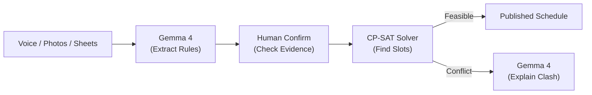
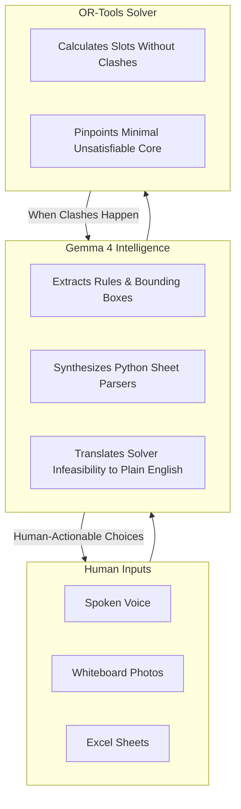
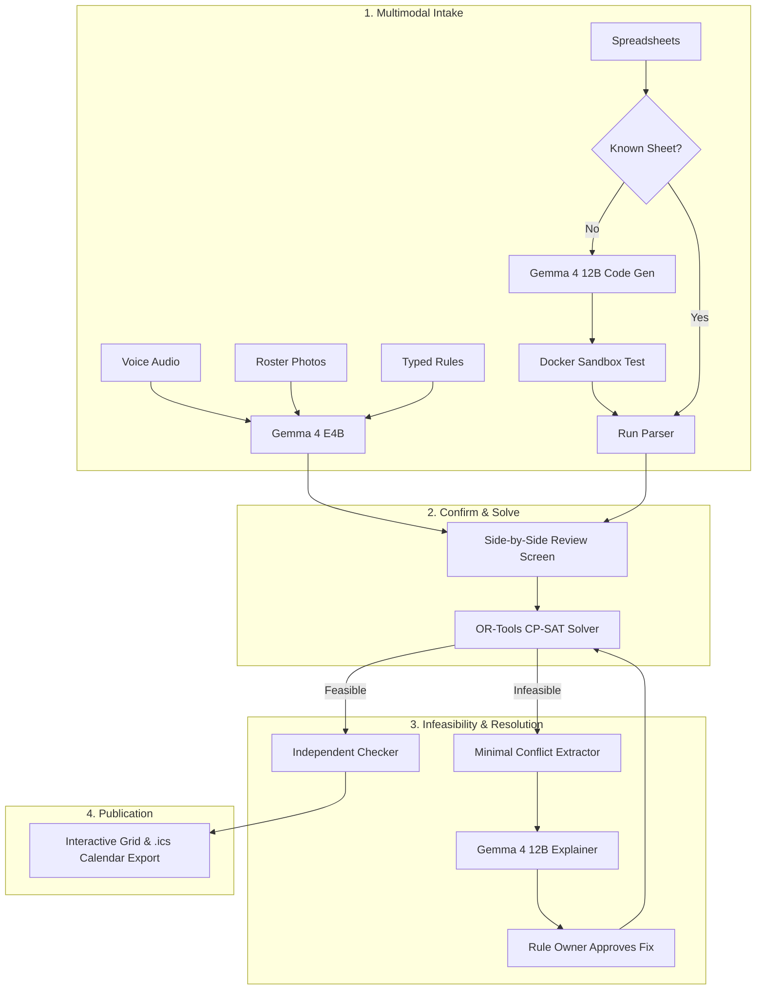
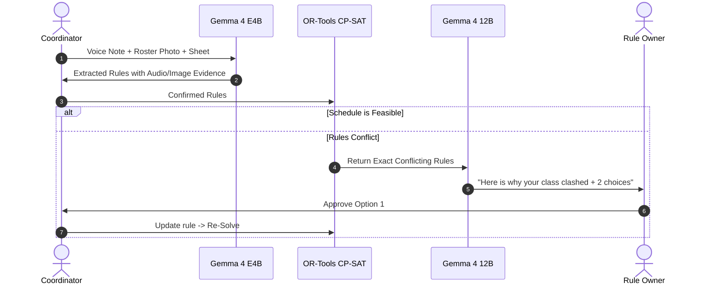
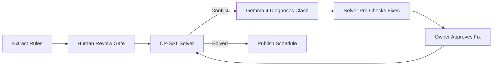

  

  <b>Multimodal Constraint Intake &bull; Solver Guaranteed Schedules</b> 
  Hacktoberfest Hack Day

  
  
  

---

## 1. Project Name

**GeCompose** (derived from *Gemma* and *composition*) is a smart scheduling system that coordinates three dedicated tools for what they do best:

- **Google Gemma 4** takes inputs from voice, photos, spreadsheets, and text, then explains scheduling conflicts in plain English.
- **Google OR-Tools CP-SAT** does the heavy math to guarantee 100% clash-free schedules.

---

## 2. Problem Statement

Every college timetable coordinator, lab manager, and event organizer faces the same nightmare:

| Pain Point | What Goes Wrong | Why Existing Tools Fail |
|---|---|---|
| **Scattered Inputs** | Constraints arrive via WhatsApp voice notes, whiteboard photos, paper slips, and messy Excel sheets. | Coordinators spend hours manually re-typing data, introducing human errors. |
| **Silent Failures** | Solvers just say "No Solution" or drop rules silently. | Nobody knows which two teachers clashed or who needs to compromise. |
| **No Consent Record** | Admins change slots unilaterally ("I never agreed to 8 AM Saturday!"). | Chat logs get deleted, spreadsheets get overwritten, and disputes drag on. |
| **LLMs Hallucinate** | Asking ChatGPT or an LLM to "build a timetable" fails. | Language models double-book classrooms and invent non-existent slots. |

---

## 3. Project Overview

GeCompose solves scheduling by giving each component one clear job:

### Clean Separation of Roles

| Component | What It Handles | What It Never Does |
|---|---|---|
| **Gemma 4** | Listens to audio, reads photos, writes sheet parsers, explains clashes | Never assigns slots or approves changes on its own |
| **CP-SAT Solver** | Places every class mathematically with zero overlaps | Never guesses human language or intent |

---

## 4. Proposed Solution

GeCompose runs a straightforward 6-step pipeline with human checkpoints at every critical step:

1. **Multimodal Intake:** Speak in English, Hindi, or Marathi, upload a photo of a whiteboard timetable, or drop an Excel sheet. Gemma 4 E4B extracts clean rules with proof tags (audio timestamps, image crops, spreadsheet cells).
2. **Automated Sheet Parsers:** For new spreadsheet layouts, Gemma 4 writes a small Python parser script and runs it in a safe Docker sandbox. Once verified, that parser is saved. Future files with that format run instantly with zero model tokens used.
3. **Review & Confirm:** You see every rule side-by-side with its source crop or audio playback. You click confirm before anything enters the solver.
4. **Mathematical Solving:** Google CP-SAT calculates a clash-free timetable. Hard rules are 100% satisfied by math.
5. **Plain-English Explanations:** If rules clash, CP-SAT pinpoints the exact conflicting subset. Gemma 4 tells you in plain English: "Prof. Rao cannot do Monday, but Section A Lab is pinned to Monday and only Prof. Rao can take it." It suggests solver-verified fixes.
6. **Approval:** The affected teacher or coordinator approves the fix. The final schedule is published.

---

## 5. Objectives

- **100% Valid Schedules:** Zero double-booked rooms or unavailable teacher clashes.
- **True Multimodal Support:** Voice, photos, and spreadsheets handled through Gemma 4 without chaining separate OCR or speech APIs.
- **Zero-Token Sheet Reuse:** Write spreadsheet parsers once; re-use them forever for free.
- **Clear Explanations:** When a schedule is impossible, explain exactly who clashed and why.
- **Privacy by Default:** Audio, photos, and availability stay on your local machine.
- **Runs on a Laptop:** Intake runs on consumer GPUs (under 8 GB VRAM with 4-bit quantization).
- **Measurable Proof:** Show with real numbers that an LLM alone produces clashes while GeCompose produces none.

---

## 6. Target Users / Use Case

### Who Needs This?

- **College Department Coordinators:** Managing 50+ faculty members who submit availability over WhatsApp audio and paper notes.
- **Exam Cells:** Generating invigilation shifts where teachers demand fair rotation and zero overlaps.
- **Shared Research Labs:** Scheduling access to shared microscopes or computing clusters across competing departments.
- **Student Hackathons & Fests:** Allocating speaker slots, workshop rooms, and judging panels with last-minute speaker changes.

### A Real Example: The Monday Morning Clash

1. **Intake:** The coordinator speaks: "Prof. Rao cannot take Monday morning classes." They also upload `workload.xlsx`, which shows Prof. Rao is the only teacher for the Database Lab. Another note pins the Database Lab to Monday morning.
2. **Conflict:** CP-SAT reports that satisfying all three rules is impossible.
3. **Gemma 4 Explains:** "Database Lab is pinned to Monday, Prof. Rao is the only qualified instructor, but Prof. Rao is unavailable on Monday mornings."
4. **Verified Options:** Gemma 4 proposes:
   - **Option 1:** Move Database Lab to Tuesday 10 AM (Needs approval from Department Head).
   - **Option 2:** Add Prof. Mehta as co-instructor (Needs approval from Dean).
5. **Approval:** The Department Head approves Option 1. CP-SAT instantly re-solves with minimum disruption and publishes the final schedule.

---

## 7. Open-Source AI Technology Selected

### Google Gemma 4 Model Strategy

We use Google's open-weight **Gemma 4** family in a two-tier setup:

| Tier | Model | Size (4-bit) | Job | Why This Variant? |
|---|---|---|---|---|
| **Intake Tier** | **Gemma 4 E4B** | ~4.5 GB VRAM | Audio, photo, and text intake | Single model natively hears audio and reads images. Runs easily on laptop GPUs. |
| **Reasoning Tier** | **Gemma 4 12B** | ~7.2 GB VRAM | Writing sheet parsers and explaining conflicts | Better code synthesis for Python parsers and deeper reasoning for conflict graphs. |

Both models run locally using open-source inference runtimes like **vLLM** or **llama.cpp**.

---

## 8. Why This Technology Was Selected

- **One Model Family vs. Three Separate Tools:** Standard pipelines glue together Whisper (speech), Tesseract (OCR), and an LLM. When one makes a mistake, the whole pipeline breaks. Gemma 4 processes audio, images, and text in the same context window.
- **Native JSON Output:** Gemma 4 supports direct structured tool calling, outputting clean Pydantic data schemas without messy regex fixes.
- **Code Generation Saves Tokens:** Instead of feeding 2,000 Excel rows to an LLM every time (costing thousands of tokens), Gemma 4 writes a Python parser once. The Python script parses all future sheets in milliseconds at zero token cost.
- **Thinking Mode for Hard Conflicts:** Gemma 4's thinking mode is turned on only when explaining complex multi-party conflicts, keeping regular intake fast.
- **Runs Completely Offline:** Student and teacher availability data is personal. Running Gemma 4 locally means zero data leaves the building.

---

## 9. AI's Role in the System

Gemma 4 serves as the translator between humans and the mathematical solver.

### What AI Does vs. What AI Never Does

- **Gemma 4 DOES:** Parse spoken Hindi/English, read photo notices, write safe parsing scripts, and explain why two rules clash.
- **Gemma 4 NEVER:** Assign slots directly, claim a schedule is valid without the solver, approve changes for someone else, or touch private keys.

---

## 10. System Architecture

---

## 11. Component-Level Architecture

| # | Subsystem | Inputs | Outputs | Tech Used |
|---|---|---|---|---|
| **1** | **Multimodal Intake** | Spoken audio, timetable photos, text | Structured draft rules with source pointers | Gemma 4 E4B |
| **2** | **Format Adapter** | `.xlsx` and `.csv` files | Clean rows with cell references | Docker Sandbox + Python |
| **3** | **Review Screen** | Draft rules + image crops / audio clips | Confirmed rules | Streamlit UI |
| **4** | **Constraint Registry** | Confirmed rules | Rule IDs | Local SQLite |
| **5** | **CP-SAT Solver** | Mathematical constraints, previous schedule (optional) | Complete schedule or conflict set | Google OR-Tools |
| **6** | **Gemma 4 Explainer** | Conflicting rule IDs | Plain-English summary + verified options | Gemma 4 12B |
| **7** | **Schedule Publisher** | Verified timetable matrix | Timetable grid, `.ics` calendar files | Python |
| **8** | **Independent Checker** | Schedule + confirmed rules | Violation count (used for publishing and for the LLM-vs-GeCompose scoreboard) | Plain Python, no solver |

---

## 12. Data / Information Flow

### Privacy & Storage Breakdown

| Data Type | Where It Stays |
|---|---|---|
| Voice recordings & photos | Local machine only |
| Personal availability rules | Local machine only |
| Final timetable grid | Exported to `.ics` / PDF |

---

## 13. Agentic Workflow

GeCompose runs a bounded agentic loop with clear human guardrails:

- **Strict Limits:** The loop runs at most 3 relaxation cycles. If stakeholders cannot agree after 3 tries, it stops and alerts the coordinator.
- **Safe Tools:** The AI agent can only inspect the conflict graph and test candidate fixes against the solver.

---

## 14. Technology Stack

| Layer | Tool | License | Why We Picked It |
|---|---|---|---|
| **AI Models** | Google Gemma 4 (E4B & 12B) | Apache 2.0 | Native audio/vision handling, local weights, fast inference |
| **Local Inference** | llama.cpp / vLLM | MIT / Apache 2.0 | Runs 4-bit quantized models smoothly on laptop GPUs |
| **Constraint Solver** | Google OR-Tools CP-SAT | Apache 2.0 | Industry-standard discrete optimizer; mathematically guaranteed results |
| **Validation** | Pydantic v2 | MIT | Strict type enforcement for extracted constraints |
| **Code Sandbox** | Docker Engine | Apache 2.0 | Runs generated spreadsheet parsers with network access turned off |
| **Frontend UI** | Streamlit | Apache 2.0 | Interactive web UI with audio recording and image crop displays |

---

## 15. Expected Features

### Core Capabilities

- **Voice Ingestion:** Speak scheduling rules in mixed Hindi, Marathi, or English; Gemma 4 extracts structured rules with timestamps.
- **Photo Roster Scanning:** Upload photos of legacy paper timetables or whiteboard rosters with bounding-box highlighting.
- **One-Shot Sheet Parsers:** Gemma 4 writes Python code to parse custom Excel layouts; future sheets parse in milliseconds with zero tokens.
- **Zero Double-Bookings:** CP-SAT mathematically eliminates room and teacher overlaps.
- **Plain-English Explanations:** Explains schedule conflicts clearly, naming the exact people and constraints involved.
- **Pre-Verified Compromises:** Every proposed fix is tested against the solver before being shown to users.
- **Calendar Feeds:** One-click export to `.ics` for Google Calendar, Outlook, and Apple Calendar.

### Advanced Features (Demo Differentiators)

- **LLM-vs-GeCompose Scoreboard:** The same inputs are given to Gemma 4 alone ("build this timetable") and to the GeCompose pipeline. An independent checker counts double-bookings and rule violations in both outputs and shows the numbers side by side.
- **Minimal-Change Re-Solve:** After a rule changes, the solver re-solves with an objective that minimizes how many existing classes move. The UI reports "3 classes moved" instead of rebuilding the whole timetable.
- **Conflict Graph View:** The minimal conflicting rules are drawn as a small graph (for example Prof. Rao, Database Lab, Monday morning) with the clash highlighted, shown next to Gemma's plain-English explanation.
- **"Why Is This Class Here?" Button:** Click any cell in the timetable and see which rules forced that slot. Explainability for successful schedules, not only failed ones.
- **Live Hindi / Marathi Voice Rule:** A rule spoken in Hindi or Marathi is extracted live, with the audio clip attached as evidence.
- **Fairness Score (stretch):** Workload balance and teacher gap-time are tracked as soft constraints, with a before/after number.

---

## 16. Implementation Approach

Our engineering implementation divides the system into three decoupled modules, each with independent unit testing and integration criteria. A detailed backend build guide is in [`BACKEND_GUIDE.md`](BACKEND_GUIDE.md).

### Module 1: Multimodal Ingestion and Layout Parsing
- **Audio and Image Feature Lifting:** Stream raw microphone audio and document crops into Gemma 4 E4B using native structured tool calling. Map temporal references and visual regions to concrete time slots and room identifiers.
- **Sandboxed Parser Generation:** When an unindexed spreadsheet layout is uploaded, invoke Gemma 4 12B to write a standalone Python parsing function. Execute the script inside a network-isolated Docker container against 10 sample rows. Verify that outputs match the confirmed schema before caching the parser for recurring use.

### Module 2: Constraint Modeling and Conflict Isolation
- **Mathematical Scheduling Core:** Map confirmed Pydantic constraint records into Google OR-Tools CP-SAT Boolean decision variables. Formulate room capacities, instructor non-overlap, and session continuity as linear constraints.
- **Minimal Conflict Core Extraction:** When the constraint set is infeasible, trigger assumption-literal extraction in CP-SAT to isolate the exact minimal unsatisfiable subset (MUS) rather than returning a generic failure.
- **Minimal-Change Objective:** When a previous schedule exists, add an objective term that penalizes every session moved away from its previous slot.
- **Rule Provenance:** Every placed session records which rules constrain it, powering the "Why is this class here?" view.
- **Independent Checker:** A solver-free Python function re-validates any schedule (including an LLM-generated one) against the confirmed rules and returns the list of violations.

### Module 3: Coordinator Interface and Verification
- **Streamlit Frontend:** Build an interactive single-page dashboard featuring live audio capture, visual evidence crops, interactive timetable grids, conflict graph, and conflict resolution cards.
- **Scoreboard Page:** Run the LLM-only baseline and the GeCompose pipeline on the same inputs and display violation counts side by side.

### Milestone Schedule and Validation Targets

| Engineering Sprint | Core Deliverable | Validation Mechanism | Success Benchmark |
|---|---|---|---|
| **Sprint 1: Core Solver & Schema** | Constraint models, CP-SAT solver, conflict extractor, independent checker, minimal-change objective | Synthetic benchmark test suite | 100% hard rule satisfaction on 50 test instances |
| **Sprint 2: Multimodal & Sandbox** | Gemma 4 E4B intake, Docker parser sandbox | Sample audio files and diverse Excel templates | > 95% parser synthesis accuracy within 3 attempts |
| **Sprint 3: Interface & Evaluation** | Coordinator interface and evaluation | Integration test suite | Successful end-to-end demonstration |
| **Sprint 4: Frontend & Evaluation** | Streamlit UI, scoreboard, full integration | End-to-end integration test with user walkthrough | Sub-3-second rule extraction on laptop hardware |

---

## 17. Expected Final Output

1. **Interactive Web App:** A clean Streamlit application supporting microphone recording, image upload, spreadsheet drop, and live timetable grid visualization.
2. **Side-by-Side Evidence Inspector:** Click any rule to see the highlighted photo crop, audio player snippet, or spreadsheet cell it came from.
3. **Conflict Diagnostic Screen:** When rules clash, see a plain-English explanation, a conflict graph, the people involved, and one-click solver-tested fixes.
4. **Universal Export:** Download verified timetables in interactive grid view, PDF, or `.ics` calendar format.
5. **Scoreboard Page:** LLM-only vs GeCompose violation counts for the same inputs.

---

## 18. Future Scope / Scalability

- **Cross-College Resource Sharing:** Connect multiple department nodes so two colleges can share auditoriums and laboratories fairly without a central boss.
- **PDF Timetable Extraction:** Extend one-shot parser synthesis to extract timetables trapped inside messy PDF documents.

---

## 19. Open-Source Dependencies / Components

| Component | Repository Link | License | Role |
|---|---|---|---|
| **Google Gemma 4** | [ai.google.dev/gemma](https://ai.google.dev/gemma) | Apache 2.0 | Multimodal intake, parser coding, conflict explanations |
| **Google OR-Tools** | [github.com/google/or-tools](https://github.com/google/or-tools) | Apache 2.0 | Discrete constraint optimization solver |
| **llama.cpp** | [github.com/ggerganov/llama.cpp](https://github.com/ggerganov/llama.cpp) | MIT | Fast local 4-bit quantized inference |
| **Pydantic** | [docs.pydantic.dev](https://docs.pydantic.dev) | MIT | Data schema validation |
| **Docker Engine** | [docker.com](https://www.docker.com) | Apache 2.0 | Isolated container sandbox for parsing scripts |
| **Streamlit** | [streamlit.io](https://streamlit.io) | Apache 2.0 | Interactive web user interface |
| **pandas & openpyxl** | [pandas.pydata.org](https://pandas.pydata.org) | BSD-3 / MIT | Tabular dataset processing |

---

## 20. Expected Challenges and Mitigation

| # | Challenge | Severity | Practical Mitigation |
|---|---|---|---|
| **1** | Spoken Dialect & Accents | Medium | Gemma 4 multilingual training + coordinator confirms every rule before solving. |
| **2** | Blurry Whiteboard Photos | Medium | Confidence scoring flags low-res crops and asks for manual confirmation. |
| **3** | Unsafe Generated Code | Critical | Generated Python parsers run in a container with **network access disabled** and strict timeouts. |
| **4** | Solver Stalling on Huge Schedules | High | 10-second solver timeout with soft-constraint relaxation heuristics. |
| **5** | Changed Spreadsheet Layouts | Medium | If more than 5% of rows fail, the system automatically triggers a re-synthesis of the parser. |

| **6** | Laptop GPU Memory Limits | High | Lightweight E4B model for intake; larger 12B model called only when a conflict occurs. |
| **7** | Live Demo Failure | High | Every Gemma call has a recorded-fixture fallback so the full flow can run without the model. |

---

### Project and Team Details

| Item | Details |
|---|---|
| **Project Title** | GeCompose |
| **Track** | 2. Best Use of Gemma 4 / Gemma 4 Open-Source|
| **Team Name** | PhishTank |
| **Members** | Rounak Mishra [@rounakkm](https://github.com/rounakkm) |
|             | Anuj Lulu [@ANUJ760](https://github.com/ANUJ760)       |
|             | Adarsh Jha [@Adarsh2709](https://github.com/Adarsh2709)|
|             | Shlok Tiwari [@1shhlok](https://github.com/1shhlok)    |

---
