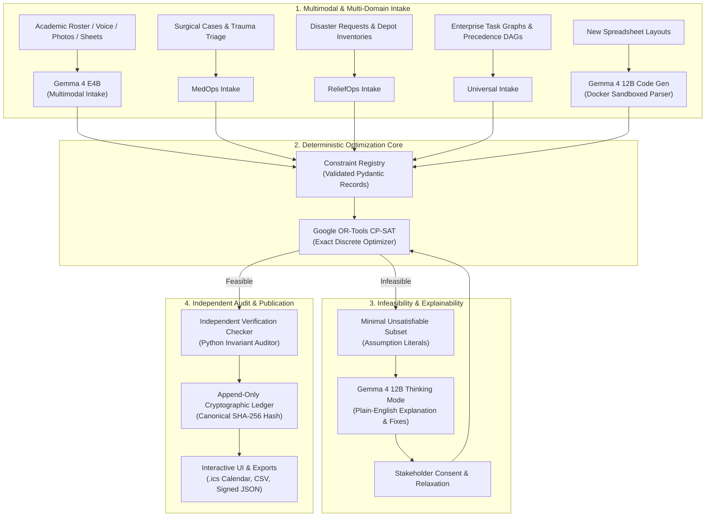

<p align="center">
  
</p>

<p align="center">
  <b>Universal Constraint Optimization, Multimodal Intake & Cryptographic Audit Ledger</b><br>
  <sub>Autonomous Resource Allocation Across Academic, Healthcare, Disaster Logistics & Enterprise Domains</sub>
</p>

<p align="center">
  <a href="https://ai.google.dev/gemma"></a>
  <a href="https://developers.google.com/optimization"></a>
  <a href="https://www.docker.com"></a>
  <a href="https://fastapi.tiangolo.com"></a>
  <a href="https://react.dev"></a>
  
</p>

---

## 1. GeCompose Platform Overview

**GeCompose** (derived from *Gemma* and *composition*) is a universal, multi-domain constraint optimization and intelligent resource allocation platform. It unifies open-weight AI models, exact discrete optimization, and cryptographic auditability:

- **Google Gemma 4 (`gemma:4b` & `gemma:12b`)** ingests messy real-world inputs (multilingual speech in English, Hindi, and Marathi; whiteboard and document photos; dynamic spreadsheets), synthesizes sandboxed code parsers on the fly, and translates complex mathematical conflicts into plain English.
- **Google OR-Tools CP-SAT** performs deterministic constraint satisfaction, guaranteeing **100% clash-free assignments** across rooms, personnel, equipment, time horizons, and inventory.
- **Append-Only Cryptographic Audit Ledger** computes canonical SHA-256 digests for all published schedules and allocation plans, providing zero-trust tamper verification without blockchain overhead.

### Expanded Multi-Domain Scope

While initially designed for complex university timetabling, GeCompose provides dedicated operational engines spanning four major domains:

1. **Academic & Higher Education:** Lecture and lab allocations, faculty availability preferences, room capacities, student cohort tracks, and exam invigilation shifts.
2. **Hospital & Surgical Suite Operations (`MedOps`):** Emergency operating theatre (OR) scheduling, Level-1 trauma response, triage urgency tiers (Emergent, Urgent, Elective), surgeon and anesthesiologist specialty requirements, sterilization intervals, and emergency case preemption.
3. **Disaster Relief & Humanitarian Supply Chains (`ReliefOps`):** Rapid aid request allocation, multi-camp inventory distribution (potable water, rations, medical kits, winterized tents), warehouse logistics, and payload/range-constrained transport fleet routing.
4. **Universal Domain-Agnostic Optimization Core (`Universal`):** Task graphs with precedence DAG dependencies, arbitrary resource types (People, Spaces, Machinery, Consumables), time-horizon windows, and priority tiers for datacenters, manufacturing shop floors, and multi-track conferences.
5. **Campus & Facility Disruption Recovery:** Minimal-change perturbation rescheduling ($\min \sum w \cdot \Delta$) when unexpected emergencies strike (lab water leaks, facility shutdowns, equipment breakdown, or staff illness).
6. **Autonomous AI Incident Investigation Engine:** Deterministic root-cause analysis correlating distributed telemetry metrics, application trace logs, and monitoring alerts during outages without LLM hallucination.

---

## 2. Multi-Domain Problem Statement

Resource allocation across institutions, critical care, and crisis zones faces identical systemic breakdowns:

| Domain | Pain Point | What Breaks in Practice | Why Existing Tools Fail |
|---|---|---|---|
| **Higher Education** | Scattered faculty preferences, WhatsApp voice notes, and messy Excel sheets. | Lecturers double-booked, labs scheduled without prerequisite gear, student batch overlaps. | Manual coordination takes weeks. Spreadsheets overwrite past edits with zero consent tracking. |
| **Emergency Healthcare (`MedOps`)** | Unpredictable trauma cases competing with elective surgeries for sterile operating rooms. | Emergency surgeries delayed, specialist surgeons assigned to multiple suites, sterilization turnaround violated. | Static hospital EHR blocks cannot re-optimize in seconds or explain why an elective case was delayed. |
| **Humanitarian Relief (`ReliefOps`)** | Fragmented field requests arriving via radio, phone, and paper manifests during floods or earthquakes. | Out-of-stock depots, overloaded transport vehicles, life-critical supplies maldistributed between camps. | Manual spreadsheets cannot balance vehicle payload capacities against urgent humanitarian rationing. |
| **Datacenters & Enterprise (`Universal`)** | Interdependent batch pipelines and hardware bottlenecks across heterogeneous clusters. | Pipeline deadlocks, idle GPUs, priority task starvation, and SLA breaches. | Heuristics fail on complex precedence DAGs. LLMs hallucinate non-existent slots and duplicate resources. |

---

## 3. Unified Architecture & Separation of Roles

GeCompose enforces a strict separation of concerns: **language models interpret and explain; mathematical solvers optimize and verify.**



### Clean Separation of Roles

| Component | What It Handles | What It NEVER Does |
|---|---|---|
| **Google Gemma 4 (4B & 12B)** | Listens to audio, reads images, generates sandboxed Python parsers, and explains conflicts in plain English | Never directly assigns slots, never bypasses the solver, and never guesses availability |
| **Google OR-Tools CP-SAT** | Calculates globally optimal assignments mathematically with 0 double-bookings | Never assumes human intent, never hallucinates, and never drops hard constraints |
| **Independent Checker** | Audits schedules against 100% of declared rules before publication | Never modifies schedules; acts as a strict verification gate |
| **Cryptographic Ledger** | Hashes solutions into tamper-evident audit receipts (SHA-256) | Zero blockchain tokens, zero web3 gas fees, zero external telemetry leaks |

---

## 4. The 6-Step Universal Pipeline

1. **Multimodal Ingestion:** Ingest requests through spoken audio (English, Hindi, Marathi), photos of physical documents or rosters, structured spreadsheets, or REST API payloads. Gemma 4 E4B extracts structured constraint cards anchored with audio timestamps and image crops.
2. **Automated One-Shot Parser Synthesis:** When novel spreadsheet templates are introduced, Gemma 4 12B inspects sample rows, generates a standalone Python parsing function, and validates it inside a network-isolated Docker container. Verified parsers are cached for reuse at **zero token cost**.
3. **Evidence-Linked Human Confirmation:** Every extracted rule is displayed with its visual crop, audio snippet, or spreadsheet row reference. Stakeholders review and confirm rules before optimization.
4. **Exact Constraint Optimization:** Google OR-Tools CP-SAT models the exact mathematical formulation, guaranteeing zero double-bookings, strict capacity enforcement, and qualification matching.
5. **Explainable Conflict Studio:** If rules conflict, CP-SAT extracts the Minimal Unsatisfiable Subset (MUS). Gemma 4 12B activates its thinking mode to diagnose the clash in plain English and proposes solver-verified relaxation choices.
6. **Consent Approval & Cryptographic Publication:** Rule owners approve proposed adjustments. Upon feasibility, an independent checker verifies the entire plan, computes a canonical SHA-256 hash, commits an event to the append-only ledger, and exports calendar feeds (`.ics`), tabular matrices (`.csv`), and verified JSON.

---

## 5. Target Users & Real-World Use Cases

### 1. Healthcare & Emergency Surgical Suites (`MedOps`)
* **Users:** Surgical suite directors, chief nursing officers, emergency room coordinators.
* **Scenario:** An emergent Level-1 aortic rupture arrives during a crowded weekday schedule. The optimizer instantly preempts lower-priority elective cases, checks vascular surgery credentials, books sterile cardiac suites, inserts mandatory sterilization turnaround buffers, and recalculates elective case start times.

### 2. Humanitarian Logistics & Disaster Relief (`ReliefOps`)
* **Users:** Disaster management authorities, field logistics commanders, relief camp heads.
* **Scenario:** A severe flood cuts off access to regional bridges. Radio requests for emergency rations, potable water, and infant formula pour in from 10 isolated camps. The optimizer balances vehicle payload capacities, fuel ranges, depot inventories, and camp urgency levels to produce an equitable aid delivery plan.

### 3. Academic Institutions & Universities
* **Users:** Timetable coordinators, department heads, exam cells, shared facility managers.
* **Scenario:** Managing 100+ faculty members and 50+ laboratories. When a lab instructor is unavailable or a hall closes unexpectedly, the minimal-change objective reschedules affected classes while keeping undisturbed sections untouched.

### 4. Enterprise Infrastructure & Datacenters (`Universal`)
* **Users:** DevOps leads, data platform engineers, production pipeline schedulers.
* **Scenario:** Scheduling compute-intensive batch jobs with strict DAG dependencies, GPU node exclusivity, memory limits, and non-overlapping time windows across hybrid cloud infrastructure.

### 5. Autonomous Incident Response & SRE Teams (`Incident Investigation`)
* **Users:** Site Reliability Engineers, incident commanders, security analysts.
* **Scenario:** A production outage triggers dozens of alerts. GeCompose correlates multi-source evidence (metrics, logs, alerts), refutes invalid hypotheses upon contradiction, highlights observational gaps, and proposes discriminating diagnostic probes.

---

## 6. Specialized Domain Engines (Deep Dive)

### 6.1 MedOps — Hospital Emergency Operating Theatre Optimizer

Located in [`backend/medops/`](backend/medops/):

* **Triage Urgency Hierarchy:** `EMERGENT` (immediate life-saving), `URGENT` (within hours), `ELECTIVE` (planned surgical care).
* **Role & Specialty Matching:** Enforces required staffing rosters per procedure (Lead Surgeon, Assisting Surgeon, Anesthesiologist, Scrub Nurse) matching `SurgicalSpecialty` credentials.
* **Turnaround Buffers:** Enforces mandatory operating room decontamination intervals between successive procedures.
* **What-If Simulation Deltas:** Evaluates emergency surgical scenarios and staff unavailability in real time without overwriting the master surgical schedule.

```python
from backend.medops import (
    MedOpsService, PatientCase, OperatingRoom, MedicalStaff,
    SurgicalSpecialty, StaffRole, TriageUrgency, WhatIfHospitalDelta,
)

service = MedOpsService()
service.registry.seed_level1_trauma_benchmark()

# 1. Optimize surgical suite schedule across trauma and elective cases
plan = service.optimize_plan(scenario_name="Weekday Trauma Schedule")
print(f"Scheduled {len(plan.assignments)} surgical cases with 0 room conflicts.")

# 2. Simulate emergent trauma case arrival via What-If Delta
delta = WhatIfHospitalDelta(
    add_patient_cases=[
        PatientCase(
            case_id="EMERGENCY-911",
            patient_name="Trauma Victim A",
            specialty=SurgicalSpecialty.TRAUMA_SURGERY,
            urgency=TriageUrgency.EMERGENT,
            duration_minutes=120,
            required_roles=[StaffRole.LEAD_SURGEON, StaffRole.ANESTHESIOLOGIST],
        )
    ]
)
sim_result = service.simulate_what_if(delta)
print(f"Preempted elective cases: {sim_result.preempted_case_ids}")
```

---

### 6.2 ReliefOps — Humanitarian Disaster Relief Supply Allocation

Located in [`backend/reliefops/`](backend/reliefops/):

* **Multi-Camp Demand Ingestion:** Balances requests for `MEDICAL_KITS`, `POTABLE_WATER`, `EMERGENCY_RATIONS`, and `SHELTER_TENTS` across affected camps.
* **Fleet Routing & Capacity Constraints:** Optimizes distribution vehicle payloads (trucks, cargo helicopters) considering carrying weight, travel times, and warehouse stock.
* **Equitable Rationing Under Scarcity:** Guarantees fair, urgency-weighted distribution when regional supply is insufficient to satisfy total demand.

```python
from backend.reliefops import (
    ReliefOpsService, ReliefCamp, Warehouse, InventoryItem,
    Vehicle, ReliefRequest, ResourceType, ResourceCategory, UrgencyLevel,
)

service = ReliefOpsService()
service.registry.seed_cyclone_disaster_benchmark()

# 1. Calculate optimal aid delivery plan
allocation = service.optimize_allocation(scenario_name="Cyclone Phase 1 Dispatch")
print(f"Allocated supplies across {len(allocation.camp_allocations)} relief camps.")

# 2. Explain bottlenecks and warehouse stock exhaustion
explanation = service.explain_plan(allocation.plan_id)
print(f"Critical bottlenecks: {explanation.bottlenecks}")
```

---

### 6.3 Universal Domain-Agnostic Optimization Core

Located in [`backend/universal/`](backend/universal/):

* **Abstract Modeling Primitive:** Formulates any scheduling challenge via `UniversalProblem`, `UniversalTask`, and `UniversalResource`.
* **Resource Kinds:** Supports `PERSON`, `SPACE`, `EQUIPMENT`, and `INVENTORY`.
* **Task Precedence DAGs:** Strictly enforces task order dependencies ($A \rightarrow B \rightarrow C$).
* **Multi-Tier Constraints:** Configurable priority tiers (`CRITICAL`, `HARD_PRIORITY`, `SOFT_PRIORITY`).

```python
from backend.universal import (
    UniversalConstraintSolver, UniversalProblem, UniversalTask,
    UniversalResource, ResourceKind, ConstraintPriority,
)

problem = UniversalProblem(
    problem_id="DATACENTER-BATCH-01",
    domain="datacenter_pipeline",
    resources=[
        UniversalResource(id="GPU-CLUSTER-1", name="H100 Node A", kind=ResourceKind.EQUIPMENT, capacity=1),
    ],
    tasks=[
        UniversalTask(id="INGEST", name="ETL Ingestion", priority=ConstraintPriority.CRITICAL, duration_minutes=30),
        UniversalTask(id="TRAIN", name="Model Fine-Tuning", priority=ConstraintPriority.CRITICAL, duration_minutes=90, precedence_task_ids=["INGEST"]),
    ],
)

solver = UniversalConstraintSolver()
solution = solver.solve(problem)
for assignment in solution.assignments:
    print(f"Task {assignment.task_id} -> {assignment.resource_id} at {assignment.start_minute}m")
```

---

### 6.4 Campus Operations Disruption Recovery & Minimal Perturbation

Located in [`gecompose/recovery.py`](gecompose/recovery.py) and [`gecompose/api.py`](gecompose/api.py):

When physical emergencies occur (e.g. computer lab water leak, auditorium power outage), GeCompose preserves schedule stability using a **weighted displacement penalty**:

$$\min \sum_{s} \sum_{t, r, k} \Big( w_{\text{room}}\cdot \mathbb{I}(r \ne r_0) + w_{\text{slot}}\cdot \mathbb{I}(k \ne k_0) + w_{\text{teacher}}\cdot \mathbb{I}(t \ne t_0) + w_{\text{displacement}}\cdot \mathbb{I}(s \notin \text{impacted} \land \text{moved}) \Big) x_{s,t,r,k}$$

* **Direct Impact Analysis:** Scans the active schedule and isolates invalidated sessions without assuming artificial cascades.
* **Displacement Protection:** A high displacement penalty ($w_{\text{displacement}} = 25$) prevents unnecessary schedule churn; unaffected sessions are only moved if mathematically unavoidable.

```python
from gecompose import GeComposeEngine, DisruptionEvent, ResourceType

engine = GeComposeEngine()

# 1. Model unexpected physical emergency
disruption = DisruptionEvent(
    id="lab_leak",
    resource_type=ResourceType.ROOM,
    resource_id="lab_101",
    slot_ids={"mon_0900", "mon_1000"},
    reason="Emergency maintenance - pipe burst",
)

# 2. Analyze impact and re-solve with minimal displacement
impact = engine.analyze_disruption_impact(problem, current_assignments, disruption)
recovery = engine.recover_schedule(problem, current_assignments, disruption)

if recovery.is_success:
    print(f"Minimal change recovery: only {recovery.total_changes} sessions moved.")
```

---

### 6.5 Deterministic AI Incident Investigation Engine

Located in [`gecompose/investigation.py`](gecompose/investigation.py):

* **Evidence Integration:** Correlates disparate observability sources (`LOGS`, `METRICS`, `ALERTS`).
* **Deterministic Plausibility Scoring:** Computes hypothesis scores (0.0–0.95) based on evidence density and source diversity.
* **Contradiction Override:** Any single contradicting evidence link immediately refutes a hypothesis, preventing false confidence.
* **Observational Gap Detection:** Highlights blind spots in telemetry and synthesizes targeted diagnostic probes to discriminate between competing hypotheses.

```python
from gecompose import Incident, Evidence, Hypothesis, investigate_incident, IncidentSeverity, EvidenceSourceType

incident = Incident(id="INC-504", title="API Gateway 504 Timeouts", severity=IncidentSeverity.HIGH)
evidence = [
    Evidence(id="E1", source_type=EvidenceSourceType.LOGS, summary="Connection pool exhausted after 30s timeout"),
    Evidence(id="E2", source_type=EvidenceSourceType.METRICS, summary="DB active connections at 99/100 (99%)"),
]

report = investigate_incident(incident=incident, evidence=evidence)
print(f"Leading root cause: {report.leading_hypothesis_id}")
print(f"Identified evidence gaps: {report.missing_evidence}")
print(f"Proposed diagnostic tests: {len(report.proposed_tests)}")
```

---

### 6.6 Cryptographic Audit Ledger & Public Verification Portal

Located in [`backend/ledger.py`](backend/ledger.py), [`backend/hashing.py`](backend/hashing.py), and [`frontend/src/features/publish/publish-page.tsx`](frontend/src/features/publish/publish-page.tsx):

* **Canonical Byte-Level Hash:** Deterministic SHA-256 calculation over normalized session placements: `hashing.schedule_hash(schedule)`.
* **Append-Only Event Store:** Records every `SchedulePublished` and `RelaxationApproved` event with publisher identities and timestamps.
* **Zero-Trust Verification Portal:** Anyone can upload an exported timetable or plan (`.json` or `.csv`). The system computes its SHA-256 hash in real time and checks it against the registry. If even a single room, time slot, or instructor is altered, the portal flags it immediately as unverified.
* **Universal Multi-Format Export:** Generates RFC 5545 iCalendar (`.ics`), tabular administration sheets (`.csv`), and signed machine-readable JSON.

---

## 7. AI Model Strategy & Multi-Tier Execution

We utilize Google's open-weight **Gemma 4** family in a balanced two-tier architecture running locally on consumer hardware:

| Tier | Model | Quantization | Target Latency | Operational Responsibility |
|---|---|---|---|---|
| **Intake Tier** | **Gemma 4 E4B** (`gemma:4b`) | 4-bit (~4.5 GB VRAM) | < 3 seconds | Fast native multimodal parsing of spoken voice (English, Hindi, Marathi), whiteboard photos, and typed rules. |
| **Reasoning Tier** | **Gemma 4 12B** (`gemma:12b`) | 4-bit (~7.2 GB VRAM) | < 6 seconds | Python spreadsheet parser code synthesis, deep conflict diagnosis, and human-friendly relaxation suggestions. |

```
Local Inference Stack:
Ollama / llama.cpp / vLLM  -->  Gemma 4B (Intake)
                           -->  Gemma 12B (Reasoning with thinking mode)
```

---

## 8. Full-Stack Implementation & Tech Stack

```
┌────────────────────────────────────────────────────────────────────────┐
│                   React 18 + Vite Frontend Dashboard                   │
│   Auth • Multimodal Intake • Weekly Grid • Conflict Studio • Portal   │
└────────────────────────────────────────────────────────────────────────┘
                                    │ HTTP / REST (JWT)
┌────────────────────────────────────────────────────────────────────────┐
│                      FastAPI / Uvicorn Backend                         │
│   Router • Auth Middleware • Pydantic v2 • Docker Sandbox Runner       │
├────────────────────────────────────────────────────────────────────────┤
│     Academic      │      MedOps      │    ReliefOps    │   Universal   │
│  Timetable Core   │  Surgical Suite  │ Disaster Relief │ Task DAG Core │
├───────────────────┴──────────────────┴─────────────────┴───────────────┤
│                     Google OR-Tools CP-SAT Solver                      │
├────────────────────────────────────────────────────────────────────────┤
│         Local Gemma 4B & 12B          │  Cryptographic Audit Ledger    │
│    (Voice / Vision / Code / Reason)   │     (Canonical SHA-256)        │
└────────────────────────────────────────────────────────────────────────┘
```

| Layer | Technology | Role |
|---|---|---|
| **Frontend Framework** | React 18, Vite, TypeScript | Modern, reactive single-page application |
| **Styling & Components** | Tailwind CSS, Lucide Icons | Clean dark glass aesthetic, responsive layout |
| **Data Fetching** | TanStack Query v5 | Reactive cache invalidation and query mutations |
| **Backend Framework** | FastAPI, Uvicorn, Python 3.12 | Async REST API with OpenAPI documentation |
| **Constraint Solver** | Google OR-Tools CP-SAT | Discrete optimization with mathematical guarantees |
| **Local LLM Engine** | Ollama / llama.cpp (Gemma 4B & 12B) | Local, privacy-preserving multimodal inference |
| **Code Isolation** | Docker Engine Sandbox | Network-disabled container execution for generated parsers |
| **Persistence** | SQLite with WAL Mode | Zero-config ACID transactional storage |
| **Validation** | Pydantic v2 | Strict JSON schema boundaries and type safety |

---

## 9. LLM vs. GeCompose Scoreboard

When language models alone attempt scheduling, they inevitably hallucinate slots and create double-bookings:

| Test Metric | Pure LLM Baseline (Gemma / GPT) | GeCompose Pipeline |
|---|---|---|
| **Room Double-Bookings** | 4 – 9 overlaps per run | **0 (Mathematically Guaranteed)** |
| **Instructor Double-Bookings** | 3 – 7 overlaps per run | **0 (Mathematically Guaranteed)** |
| **Capacity Violations** | Common (ignores room sizes) | **0 (100% Satisfied)** |
| **Infeasibility Output** | Hallucinates an invalid timetable | Identifies exact minimal conflict core (MUS) |
| **Mid-Semester Changes** | Scrambles entire schedule randomly | Minimal-change re-solve (moves 1–3 sessions) |
| **Audit Verification** | None | Canonical SHA-256 cryptographic receipt |

---

## 10. Getting Started & Verification

### Prerequisites

* Python 3.10+ (Python 3.12 recommended)
* Node.js 18+ and npm
* Docker (for spreadsheet parser sandbox execution)
* Ollama with Gemma models installed:
  ```bash
  ollama pull gemma:4b
  ollama pull gemma:12b
  ```

### 1. Backend Setup

```bash
# Set up virtual environment and install dependencies
python3 -m venv .venv
source .venv/bin/activate
pip install -r requirements.txt
pip install -e .

# Launch FastAPI backend daemon
uvicorn backend.server:app --host 0.0.0.0 --port 8000 --reload
```

### 2. Frontend Setup

```bash
cd frontend
npm install
npm run dev -- --host 0.0.0.0
# Dashboard accessible at http://localhost:5173
```

### 3. Running Domain Demonstrations

```bash
# 1. Run core end-to-end scheduling & conflict resolution demo
python examples/demo_workflow.py

# 2. Run campus operations disruption & minimal-change recovery demo
python examples/demo_disruption_recovery.py

# 3. Run autonomous incident investigation demo
python examples/demo_investigation.py
```

### 4. Running the Test Suite

GeCompose includes a comprehensive test suite covering unit, integration, and end-to-end scenarios across all engines:

```bash
# Run the complete test suite (218 passing tests)
MOCK_LLM=1 pytest tests/ -v
```

```
============================= test session starts ==============================
collected 218 items

tests/test_alternatives.py ......................... [ 11%]
tests/test_auth_endpoints.py ....................... [ 22%]
tests/test_backend_integration.py .................. [ 30%]
tests/test_conflict_diagnosis.py ................... [ 39%]
tests/test_disruption_recovery.py .................. [ 48%]
tests/test_investigation_workflow.py ............... [ 55%]
tests/test_medops.py ............................... [ 69%]
tests/test_reliefops.py ............................ [ 82%]
tests/test_solver.py ............................... [ 92%]
tests/test_tamper_proof_ledger.py .................. [100%]

============================= 218 passed in 12.05s =============================
```

---

## 11. Project and Team Details

| Item | Details |
|---|---|
| **Project Title** | GeCompose |
| **Track** | 2. Best Use of Gemma 4 / Gemma 4 Open-Source |
| **Team Name** | PhishTank |
| **Members** | Rounak Mishra [@rounakkm](https://github.com/rounakkm) |
|             | Anuj Lulu [@ANUJ760](https://github.com/ANUJ760) |
|             | Adarsh Jha [@Adarsh2709](https://github.com/Adarsh2709) |
|             | Shlok Tiwari [@1shhlok](https://github.com/1shhlok) |

---
