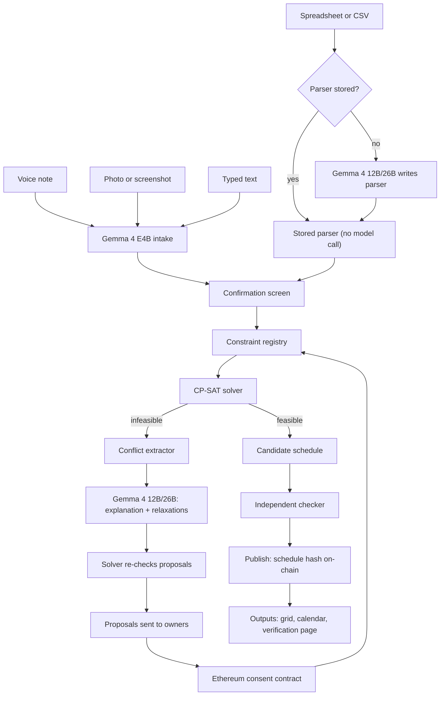
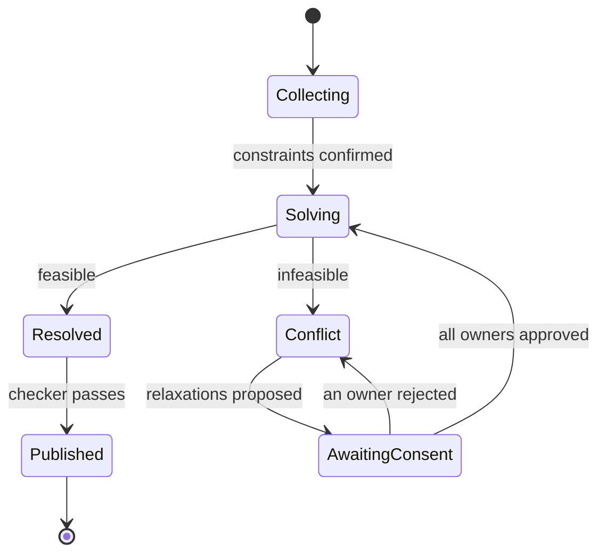

# Sanyojan

**A consent-aware scheduling system that uses Gemma 4 for multimodal input understanding and conflict explanation, a constraint solver for guaranteed valid schedules, and Ethereum for tamper-proof approval records.**

Hacktober Fest Open Source AI Hackathon | Track 2: Best Use of Gemma 4

> **Summary:** Sanyojan accepts scheduling rules through voice notes, photographs, spreadsheets or typed text. A constraint solver builds a schedule that satisfies every hard rule. When rules conflict, Gemma 4 explains the conflict in plain language, identifies exactly who is affected, and only those individuals can approve the resolution. Every approval is recorded on Ethereum.

---

## 1. Project Name

**Sanyojan** (Sanskrit/Hindi for "coordination" or "arrangement"): Multimodal, Consent-Aware Scheduling with Gemma 4.

---

## 2. Problem Statement

Timetables, duty rosters, exam invigilation lists and shared-lab bookings are still built by a coordinator working across multiple spreadsheets. Four problems persist:

1. **Scattered formats.** Constraints are spread across WhatsApp voice notes, handwritten forms, photographs of previous timetables, and spreadsheets with varying layouts. Transferring all of this into a single tool introduces errors.
2. **Unexplained failures.** When rules cannot all be satisfied, existing tools report "no solution" or silently discard a rule without identifying *which* rules conflict or *who* owns them.
3. **No tamper-proof consent record.** Disputes follow schedule changes ("I never agreed to Saturday"). Chat messages and spreadsheet edits can be lost or rewritten by the same coordinator whose conduct is in question.
4. **Language models cannot guarantee valid schedules.** A language model asked to produce a timetable directly can violate stated rules. A constraint solver, by contrast, produces schedules that satisfy hard rules by construction.

In addition, availability data is personal. Individuals do not want it uploaded to third-party cloud services.

---

## 3. Project Overview and Solution

Sanyojan converts voice, photograph, spreadsheet and text input into a verified schedule. When the rules cannot all be satisfied, it converts each infeasibility into an approval request sent to the owners of the conflicting rules.

### Separation of Duties

| Component | Responsibility | Does not |
|---|---|---|
| **Gemma 4** | Understands voice, photographs and text; writes parsers for new spreadsheet layouts; explains conflicts; proposes resolutions | Place classes in slots, certify schedules, or approve changes |
| **Solver (OR-Tools CP-SAT)** | Finds valid schedules; identifies the minimal set of conflicting rules; re-checks every proposed resolution | Interpret human language |
| **Ethereum (ConsentLedger)** | Stores constraint ownership and hashes; accepts approvals only from the registered owner; records published schedule hashes | Hold funds, store personal data, or verify schedule correctness |

### Flow

1. **Intake:** The coordinator speaks, uploads photographs or screenshots, uploads spreadsheets (.xlsx or .csv), or types. Gemma 4 converts all inputs into structured constraint objects, each linked to its source (audio timestamp, image region, text span, or spreadsheet cell). For a spreadsheet layout that has not been seen before, Gemma 4 writes a parser once. The stored parser handles all subsequent files of the same layout without requiring further model calls.
2. **Confirm:** Every extracted constraint is displayed alongside its source evidence and a plain-language paraphrase. A human confirms it before it is registered.
3. **Solve:** The solver builds a schedule or reports that the constraints are infeasible.
4. **Explain:** If the constraints are infeasible, the solver returns the minimal conflicting subset. Gemma 4 explains the conflict and proposes ranked relaxations, each of which the solver re-checks for feasibility.
5. **Consent:** Each proposed relaxation is sent to the owner of the affected rule. The owner approves or rejects it on-chain.
6. **Publish:** Once all required approvals are received and the independent checker confirms zero violations, the schedule hash is published on-chain.

All AI inference runs locally on open-weight models.

### Solution Layers

| Layer | Description |
|---|---|
| Multimodal intake | Gemma 4 converts voice, images and text into constraint objects through function calling |
| Format adapter (parser synthesis) | Gemma 4 writes and tests a Python parser for each new spreadsheet layout. Stored parsers handle subsequent files of the same layout without using any model tokens |
| Confirmation screen | Displays each constraint alongside its source evidence and paraphrase |
| Constraint registry | Stores each constraint with its owner, type (hard or soft), and a salted hash |
| Solver (CP-SAT) | Builds schedules that guarantee all hard rules are satisfied |
| Conflict extractor | Identifies the minimal subset of rules that conflict |
| Gemma 4 explainer | Explains conflicts and ranks proposed relaxations |
| Consent contract | Enforces owner-only approval and maintains an append-only history |
| Publisher and verifier | Exports timetable grids and calendar files; provides a verification page that compares a file hash against the on-chain value |
| Evaluation harness | Measures extraction accuracy, rule violations, and explanation quality |

---

## 4. Objectives

- Accept scheduling rules through **voice, image and text** using a single open model family.
- Parse spreadsheets using **stored, tested parsers**. Each layout requires a model call only the first time it appears.
- Guarantee **zero hard-rule violations** in every published schedule.
- When the constraints are infeasible, **identify the exact conflicting rules and their owners** and propose solver-verified resolutions.
- Make every change **consent-based and auditable** through on-chain recording.
- Keep personal data **private** through local inference, with only salted hashes stored on-chain.
- Run on **modest hardware** (a laptop-class GPU for the smaller tier).
- Accept mixed **Hindi, Marathi and English** speech, with extraction accuracy reported per language.
- Deliver a **reproducible evaluation** under the Apache 2.0 license.

---

## 5. Target Users and Use Cases

| User | Need |
|---|---|
| College timetable cells and department coordinators | Build and revise class timetables from scattered inputs |
| Exam cells | Invigilation duties and seating plans with fairness and conflict rules |
| Shared-lab and inter-college resource managers | Resource booking among parties who do not fully trust a single administrator |
| Hostels, NGOs and volunteer groups | Duty rosters collected through chat messages and voice notes |
| Event organisers (hackathons, college fests) | Session and room schedules with speaker availability constraints |

**Core use case:** A coordinator dictates rules in Hindi and English, uploads a photograph of last year's timetable and the room list, and receives a verified schedule. When two rules conflict, their owners receive a plain-language explanation and approve a resolution.

---

## 6. Open-Source AI Technology Selected

**Primary model family: Google Gemma 4** (open weights, **Apache 2.0**).

According to the official model card, Gemma 4 is available in five sizes (**E2B, E4B, 12B, 26B A4B, 31B**) with context windows ranging from 128K to 256K tokens. All variants accept text and image input. Audio input is supported on the E2B, E4B and 12B variants. The family provides a thinking mode, native function calling, and support for over 140 languages.

| Role in Sanyojan | Variant | Reason |
|---|---|---|
| **Intake:** converts voice, image and text into constraints | **E4B**, 4-bit quantised (approximately 4.5 GB) | Handles audio, image and text within a single model |
| **Reasoning:** conflict explanation, relaxation ranking, parser writing | **12B** or **26B A4B** (approximately 6.7 to 14.4 GB at 4-bit) | Provides stronger reasoning and code generation capabilities |

**Supporting components** (see Section 13 for the full stack): OR-Tools CP-SAT, Pydantic, pandas, openpyxl, a container-based sandbox, Foundry, OpenZeppelin, web3.py or ethers.js, and Streamlit or Gradio.

*Note: Exact checkpoint names and memory figures will be confirmed against the official model card at the start of the final round.*

---

## 7. Why This Technology Was Selected

- **One model family for three input types.** A pipeline of separate speech recognition, OCR and language model components passes plain text between stages, losing cross-modal context. Gemma 4 receives audio and images within the same session.
- **Native function calling** allows the model to emit schema-valid constraint objects directly.
- **Code generation** enables parser synthesis, with a sandbox and automated tests checking every generated parser.
- **Token savings from stored parsers.** Per-row extraction incurs token costs proportional to the number of rows. Parser synthesis is a one-time cost that does not depend on file size. Subsequent files with the same layout require zero model tokens.
- **Thinking mode, used selectively.** The thinking mode is activated only when explaining complex conflicts that benefit from deeper reasoning.
- **Local and private.** The Apache 2.0 license permits unrestricted institutional use. Personal data remains on the coordinator's machine.
- **Multilingual.** Gemma 4 supports Hindi, Marathi and English code-mixing. Extraction accuracy is measured separately for each language.
- **A range of model sizes that fit a single laptop.** The smaller model handles high-volume intake, and the mid-size model is called only when a conflict requires explanation.

**Why the model does not build the schedule:** Hard rules must hold in every output, and language models provide no such guarantee. The evaluation includes a language-model-only baseline that counts hard-rule violations for comparison.

---

## 8. AI's Role in the System

Gemma 4 serves as the **interface between people and the solver**. It converts human input into the solver's constraint format, and converts the solver's output into explanations that people can act on.

**What the AI does:**
1. **Multimodal constraint extraction.** Converts voice, photographs and text into structured constraint objects with source pointers and confidence scores.
2. **Parser synthesis.** Writes Python parsers for new spreadsheet layouts and rewrites them when tests fail. Stored parsers handle all subsequent files of the same layout.
3. **Clarifying questions.** Asks for clarification when input is ambiguous.
4. **Paraphrase for confirmation.** Restates each constraint in plain language so that a human can verify correctness.
5. **Conflict explanation.** Explains why a set of rules cannot all be satisfied, naming the people and rules involved.
6. **Relaxation proposals.** Suggests ranked resolutions, using the solver as a feasibility-checking tool.
7. **Change summaries.** Writes the human-readable summary attached to each published version.

**What the AI does not do:** assign classes to slots, declare a schedule valid, approve any change, submit on-chain transactions, or read individual spreadsheet rows once a parser has passed its tests.

---

## 9. System Architecture

**Round lifecycle:**

The contract records three on-chain states: Open (covering Collecting, Solving, Resolved, Conflict off-chain), AwaitingConsent, and Published.

### Architectural Decisions

| # | Decision | Reason |
|---|---|---|
| AD-1 | Solver is the only component that assigns classes to slots | Hard rules must hold in every output |
| AD-2 | Extracted constraints are human-confirmed before registration | A misread rule is caught before it changes a schedule |
| AD-3 | Ethereum contract enforces owner-only approval | Coordinator cannot approve on an owner's behalf or edit history |
| AD-4 | Only hashes on-chain | Personal data stays off-chain |
| AD-5 | Model process holds no private key or consent-calling tools | Consent actions exist only as human-signed transactions |
| AD-6 | Consent layer uses a five-call interface | Solver, checker and Gemma 4 tiers are decoupled from the consent implementation |
| AD-7 | Spreadsheets parsed by stored, immutable parsers | A layout costs model tokens only once; same file always gives same output |
| AD-8 | Parser code runs only in an isolated sandbox | Generated code is untrusted until tested |

---

## 10. Component-Level Architecture

| # | Component | Responsibility | Inputs | Outputs |
|---|---|---|---|---|
| 1 | **Multimodal intake** | Convert audio, images and text into constraint objects via function calling | Voice, photographs, text | Draft constraints with sources and confidence scores |
| 1a | **Format adapter** | Write, test and store parsers for spreadsheet layouts; execute stored parsers in a secure sandbox | .xlsx or .csv files | Constraint objects with source cell references |
| 2 | **Confirmation screen** | Display each constraint alongside its evidence and paraphrase | Draft constraints | Confirmed constraints |
| 3 | **Constraint registry** | Assign owner address, constraint type (hard or soft), and salted hash | Confirmed constraints | Registered constraints |
| 4 | **Solver** | Construct schedules satisfying all hard rules | Registered constraints | Schedule or infeasible status |
| 5 | **Conflict extractor** | Identify the minimal conflicting subset of rules | Infeasible model state | Conflicting constraint subset and owners |
| 6 | **Explainer** | Explain conflicts; generate and verify candidate relaxations | Conflicting subset | Explanation and ranked resolution proposals |
| 7 | **Consent contract** | Enforce owner-only approvals and maintain an append-only audit trail | Proposals and signed transactions | Event logs and published hashes |
| 8 | **Independent checker** | Re-verify every hard rule against the final schedule | Schedule and constraints | Pass or fail status with violation details |
| 9 | **Publisher** | Export timetable grids, calendar files, and verification utilities | Final schedule | Formatted outputs and verification proofs |
| 10 | **Evaluation harness** | Reproducible scoring and performance benchmarks | Curated benchmark datasets | Quantitative metrics and ablation reports |

**Constraint object fields:** identifier, owner, rule type (hard or soft), category, parameters, penalty weight (for soft rules), source (modality and reference pointer), extraction confidence, and paraphrase.

**Initial constraint types:** individual or room unavailability, daily or consecutive hour limits, mandatory consecutive slots (laboratory sessions), room capacity and equipment criteria, fixed assignments, exclusion of double-booking, subject spacing rules, mandatory break periods, and soft preferences.

### Format Adapter: Parser Synthesis

*Scope:* .xlsx and .csv inputs. Extraction from tabular PDF documents is planned for future releases (Section 16).

*Layout fingerprint:* A cryptographic hash derived from sheet names and normalized header rows. Files sharing an identical fingerprint reuse the stored parser.

*Synthesis procedure (using reasoning-tier Gemma 4):*
1. The model receives the header structure, up to 10 sample rows, the constraint schema, and the target function contract.
2. Gemma 4 generates the parser implementation; the sandbox executes it against the sample records.
3. A coordinator reviews the parsed sample and corrects any discrepancies. These validated rows form regression tests.
4. Automated verification verifies that: (a) parser output matches confirmed rows; (b) records satisfy the Pydantic schema; (c) each object includes a source cell pointer; and (d) non-empty rows are not silently discarded.
5. In the event of a test failure, Gemma 4 inspects the error report and attempts automated repair (up to three attempts). If unsuccessful, processing reverts to row-by-row extraction.
6. A validated parser is stored with its layout fingerprint, source code, integrity hash, test records, and model metadata.

*Owner mapping:* The parser extracts owner identifiers (for example, instructor names). The coordinator maintains a mapping table connecting these identifiers to Ethereum addresses.

*Layout drift management:* An unrecognised layout fingerprint triggers automatic parser synthesis. For known fingerprints, if more than 5% of non-empty rows are skipped, the file is flagged for re-synthesis.

*Sandbox isolation:* Parsers run in a separate containerized process with network access disabled, read-only access restricted to the uploaded file, strict CPU, memory and runtime limits, and standard output as the sole communication channel. A static import inspection enforces an allowlist (pandas, openpyxl, re, datetime, json) prior to execution.

### Blockchain Layer: `ConsentLedger`

A single Solidity smart contract manages five specific functions:

1. **Registers constraint ownership:** Associates owner addresses with constraint content hashes.
2. **Enforces owner-only approval:** Reverts any transaction originating from an unauthorized address.
3. **Restricts premature publication:** Prevents schedule finalization while proposals remain pending.
4. **Maintains append-only audit logs:** Emits immutable, timestamped event records for every action.
5. **Supports public verification:** Provides read-only lookups for published schedule validity.

| Function | Authorized Caller | Operational Effect |
|---|---|---|
| `registerConstraint(owner, contentHash)` | Administrator | Registers a constraint record and emits `ConstraintRegistered`. |
| `openRound()` | Administrator | Initializes an active scheduling round. |
| `proposeRelaxation(roundId, constraintId, newContentHash, explanationHash)` | Administrator | Creates a pending proposal and sets round status to `AwaitingConsent`. |
| `approveRelaxation(proposalId)` | **Constraint Owner Only** | Approves the relaxation and updates the registered constraint hash. |
| `rejectRelaxation(proposalId)` | **Constraint Owner Only** | Rejects the relaxation while preserving the existing constraint hash. |
| `publishSchedule(roundId, scheduleHash, constraintSetHash, summaryHash)` | Administrator | Stores canonical hashes with block timestamps, transitioning round status to `Published`. |
| `getConstraint(constraintId)` (view) | Public | Returns owner address, active hash, and status. |
| `getPublication(scheduleHash)` (view) | Public | Returns associated round identifier, hashes, and timestamp. |

**Hashing structure (keccak256):**
- *Constraint hash:* Canonical JSON concatenated with a random 32-byte secret salt, preventing brute-force reconstruction of predictable availability preferences.
- *Schedule hash:* Generated from a standardized, canonically sorted schedule representation.
- *Constraint set hash:* Derived from the concatenated series of active constraint hashes ordered by identifier.

**Off-chain data preservation:** Personal identities, unhashed availability schedules, raw audio recordings, photographs, full timetable contents, and natural language explanations remain off-chain at all times.

**Deployment configuration:** The standard demonstration operates against a local Foundry (Anvil) network pre-seeded with test accounts. Optional deployment to the Sepolia testnet is supported. The contract holds no ether, maintains no payable entrypoints, and is not designed for mainnet financial operations.

**Decentralization rationale:** Because the scheduling coordinator is frequently a party to interpersonal scheduling disputes, central database records are insufficient:
1. **Cryptographic authorization:** The `approveRelaxation` entrypoint rejects transactions from any account other than the designated owner.
2. **Tamper-resistant audit history:** Historical records cannot be rewritten or expunged by administrative accounts.
3. **Independent verifiability:** Any stakeholder can independently compute schedule hashes and query the public ledger without relying on the availability or integrity of the host server.

---

## 11. Data and Information Flow

**Illustrative operational example:**

- A coordinator provides instructions in mixed Hindi and English: "Rao sir Monday ko available nahi hain. Section A ka DBMS lab Monday ko hi rakhna hai." A photograph of the prior year's schedule and an institutional workload spreadsheet (.xlsx) are uploaded concurrently.
- Three constraints are extracted: (C1) Professor Rao is unavailable on Mondays; (C2) Section A database laboratory is pinned to Monday; (C3) Professor Rao is designated as the sole qualified instructor for this laboratory. Constraints C1 and C2 originate from speech; C3 originates from the spreadsheet through a newly synthesized parser.
- The solver determines that the problem is infeasible and isolates the minimal conflicting subset: {C1, C2, C3}.
- Gemma 4 synthesizes a plain-language explanation: "Section A's laboratory must occur on Monday, only Professor Rao is qualified to instruct it, and Professor Rao is unavailable on Mondays." It offers two viable resolutions: (R1) reschedule the laboratory to Tuesday (requiring approval from the owner of C2), or (R2) assign an additional qualified instructor to the laboratory (requiring approval from the owner of C3). The solver confirms that both alternatives are feasible.
- The designated owner executes a transaction approving the selected proposal on-chain. The solver recalculates the schedule, the independent verification script confirms zero violations, and the schedule hash is published to the ledger.

---

## 12. Bounded Agentic Workflow

Sanyojan employs a structured, bounded agentic loop with strict human checkpoints:

1. **Extraction:** The intake model parses source materials into candidate constraints and prompts clarifying questions when input is ambiguous.
2. **Human Confirmation:** The coordinator validates, edits, or discards each parsed constraint before registration.
3. **Solving and Conflict Isolation:** The constraint solver builds a schedule or extracts the minimal conflicting constraint subset.
4. **Explanation and Synthesis:** The reasoning model explains root causes, designs relaxation strategies, and submits each candidate to the solver for feasibility validation.
5. **Consent Execution:** Affected constraint owners submit `approveRelaxation` or `rejectRelaxation` transactions directly to the contract. Rejections return the workflow to the explanation stage with the rejected option eliminated.
6. **Termination Boundaries:** The system permits at most three iterative relaxation rounds. Unresolved conflicts are escalated to administrators for manual intervention.

**Model tool access:** The reasoning model may invoke function calls to record draft constraints, request clarification, inspect conflict graphs, verify proposed relaxations with the solver, compose version summaries, and dispatch parser implementations to the sandbox.

**Security guardrails:** The model process possesses no private keys and cannot trigger state-changing blockchain methods. Every proposed relaxation must pass solver feasibility verification before it is presented to users.

---

## 13. Technology Stack

| Layer | Selection | Rationale |
|---|---|---|
| AI Models | Gemma 4 E4B (intake), Gemma 4 12B or 26B A4B (reasoning and explanation) | Multimodal input understanding, code generation, and multilingual inference |
| Local Inference Runtime | Ollama, llama.cpp, or vLLM | Local open-weight execution preserving organizational data privacy |
| Structured Outputs | Native function calling and Pydantic validation | Deterministic, schema-compliant constraint serialization |
| Constraint Solver | Google OR-Tools CP-SAT | Mathematical guarantees of schedule correctness and minimal conflict isolation |
| Data Processing and Sandbox | pandas, openpyxl, Docker Engine | Tabular data ingestion within an isolated, unprivileged container runtime |
| Smart Contracts | Solidity 0.8.x (`ConsentLedger`), Foundry, OpenZeppelin | Formally verified access control and repeatable contract testing |
| Web3 Integration | web3.py or ethers.js | Standard Ethereum JSON-RPC client interactions |
| Blockchain Network | Local Anvil node (primary demonstration environment) or Sepolia testnet | Zero financial risk with deterministic test accounts |
| User Interface | Streamlit or Gradio | Interactive visual interface supporting audio capture and image uploads |
| Schedule Outputs | Grid visualizations, iCalendar (.ics) files, web verification utility | Standard export formats for calendars and academic systems |
| Benchmark Evaluation | Python, scikit-learn, matplotlib | Rigorous, repeatable experimental measurement |
| Licensing | Apache 2.0 | Open-source distribution allowing institutional deployment |

---

## 14. Implementation Roadmap and Evaluation

Development is organized into modular phases:

**Phase 1: Core Foundation (Essential)**
1. Standardized constraint schema and registry implementation.
2. Text-based intake leveraging Gemma 4 E4B with human confirmation workflows.
3. CP-SAT solver integration, independent rule validator, and timetable visualization.
4. Conflict extractor coupled with Gemma 4 automated explanations and verified relaxations.
5. Automated evaluation harness and initial benchmark dataset.

**Phase 2: Multimodal Intake and Consensus (Target)**
6. Voice ingestion pipeline utilizing Gemma 4 native audio capabilities.
7. Image ingestion for handwritten schedules, room inventories, and historical timetables.
8. Format adapter module: dynamic parser synthesis, sandbox execution, and parser registry.
9. Solidity consensus contract, automated unit tests, and local testnet integration.
10. Public verification interface.

**Phase 3: Refinement and Localization (Extensions)**
11. Optional deployment to Ethereum Sepolia testnet.
12. Explanations localized in Hindi and Marathi, alongside iCalendar exports.
13. Comprehensive ablation study and final demonstration scenarios.

### Quantitative Evaluation Plan

| Evaluation Domain | Methodology |
|---|---|
| Constraint Extraction Accuracy | Benchmarked against curated datasets spanning typed text, spoken audio (including Hindi-English mixed samples), and photographic forms. Evaluation reports precision, recall, and slot-filling accuracy per modality and language. |
| Parser Synthesis Performance | Evaluated across diverse tabular layouts. Reported metrics include synthesis success rate within three iterations, exact-match row extraction accuracy, undetected layout errors, and token savings compared to row-by-row LLM parsing. |
| Schedule Correctness | Verified via the independent validator across all generated schedules, contrasted against an unconstrained language-model baseline measuring hard constraint violation rates. |
| Conflict Analysis Quality | Verification that highlighted constraints correspond to solver-isolated minimal unsatisfiable subsets, supplemented by human assessments of explanation clarity. |
| Resolution Viability | Percentage of proposed relaxations that produce mathematically viable schedules before and after solver validation. |
| Smart Contract Security | Foundry unit test suites verifying permission boundaries, reversion conditions for unauthorized callers, invariant state preservation, and gas efficiency. |
| Computational Efficiency | End-to-end execution latency, memory footprint across quantization tiers, and token throughput per stage. |
| Ablation Studies | Incremental removal of human verification, audio-visual modalities, solver re-checks, and compiled parsers to quantify individual subsystem contributions. |

---

## 15. Deliverables

1. A **functional web application** supporting voice, image, spreadsheet, and text inputs to produce verified schedules.
2. An **interactive conflict inspector** detailing conflicting rules, constraint owners, natural language explanations, and verified fixes.
3. A **tested Solidity smart contract** deployed to an Anvil test network with an explorer interface.
4. A **public verification portal** enabling external validation of timetable authenticity against the distributed ledger.
5. **Standardized exports** providing visual timetable grids and iCalendar format feeds.
6. A **reproducible evaluation framework** providing comparative baselines and ablation results.
7. A **public GitHub repository** distributed under the Apache 2.0 license.

---

## 16. Future Scope

- **Inter-institutional coordination:** Deploying shared consent ledgers across autonomous academic departments and partner universities.
- **Gasless meta-transactions:** Implementing EIP-712 signature verification (`approveRelaxationBySig`) to allow fee-free coordinator-relayed approvals.
- **Zero-knowledge verification:** Generating cryptographic proofs that schedules satisfy all constraints without revealing private personal availability.
- **Fairness auditing:** Quantifying the distribution of soft-penalty burdens across participants to detect systemic workload imbalances.
- **Extended domains:** Adapting the underlying constraint model for hospital clinical shifts, disaster relief teams, and conference programs.
- **Expanded format synthesis:** Extending synthesis pipelines to extract structured tables from complex unstructured PDF documents.
- **Edge deployment:** Running quantized models directly on client hardware for air-gapped, offline environments.

---

## 17. Open-Source Dependencies

| Component | Function | License |
|---|---|---|
| Gemma 4 (E4B, 12B, 26B A4B) | Multimodal intake, parser synthesis, and reasoning | Apache 2.0 |
| Ollama / llama.cpp / vLLM | Local model execution | MIT / MIT / Apache 2.0 |
| Google OR-Tools | CP-SAT constraint optimization | Apache 2.0 |
| Pydantic | Schema definition and data validation | MIT |
| pandas, openpyxl | Tabular data manipulation | BSD-3-Clause / MIT |
| Docker Engine | Parser isolation sandbox | Apache 2.0 |
| Foundry | Solidity development and automated testing | MIT / Apache 2.0 |
| OpenZeppelin Contracts | Access control primitives | MIT |
| solc | Solidity compiler | GPL-3.0 |
| web3.py / ethers.js | Ethereum client connectivity | MIT |
| Streamlit / Gradio | Web presentation layer | Apache 2.0 |
| scikit-learn, matplotlib | Statistical evaluation and visualization | BSD-3-Clause / PSF |

---

## 18. Risk Management and Mitigations

| Identified Risk | Potential Impact | Mitigation Strategy |
|---|---|---|
| **Misinterpretation of voice or visual input** | Inaccurate constraints injected into the schedule | Side-by-side evidence inspection, natural language paraphrasing, confidence scoring, and mandatory human confirmation. |
| **Degraded photographic quality** | Unreliable optical extraction | Automatic prompts for clearer captures or manual text input; explicit flagging of low-confidence fields. |
| **Dialect and multilingual variability** | Suboptimal extraction on regional language inputs | Empirical testing against curated multilingual benchmarks; routing uncertain audio directly to manual transcription. |
| **Execution of synthesized parser code** | Potential resource exhaustion or unauthorized system access | Strict container isolation with network access disabled, resource quotas, and static import validation. |
| **Uncaught parser edge cases** | Undetected constraint omission | Mandatory confirmation sample testing, skipped-row threshold alerts, and summary row reviews for every file. |
| **Layout drift in subsequent files** | Incompatible parsing logic applied to revised formats | Header-based layout fingerprinting; files exceeding a 5% unparsed row threshold automatically trigger re-synthesis. |
| **Model formalization errors** | Incorrect mathematical constraints formulated | Strict Pydantic schema validation coupled with plain-language round-trip confirmation. |
| **Infeasible relaxation proposals** | Stakeholders prompted to approve non-viable compromises | Automated re-solving filters out invalid relaxation candidates before human presentation. |
| **Unauthorized administrative publication** | Discrepancies between published hash and actual schedule | Public independent verification script comparing local files against on-chain constraint hashes. |
| **Participant wallet accessibility** | Inability of non-technical stakeholders to sign transactions | Demonstration accounts pre-configured with local credentials; long-term support for gasless EIP-712 signatures. |
| **Public testnet instability** | Dependency on external faucet infrastructure | Primary demonstration self-contained on local Anvil nodes; public testnets treated as optional extensions. |
| **Smart contract vulnerabilities** | Unauthorized modification of constraint state | Minimal custom logic, integration of battle-tested OpenZeppelin modules, and extensive automated test suites. |
| **Privacy leak of schedule preferences** | Unauthorized visibility into personal availability | Strictly local inference; only cryptographic hashes and salts stored on public ledgers. |
| **Project timeline constraints** | Incomplete deliverables at competition deadline | Tiered architectural design ensuring a functional core system operates independently of advanced extensions. |
| **Local hardware limitations** | High GPU memory pressure | Intake tier runs quantized E4B locally; reasoning tasks support quantized 12B or selective offloading. |

---

*Team details, contact information, and license files will be finalized in repository metadata. This repository contains only this documentation in compliance with submission guidelines.*
