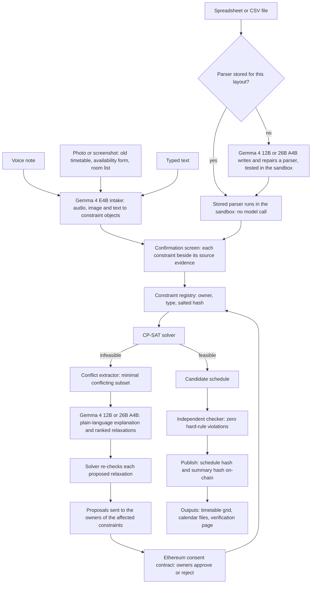
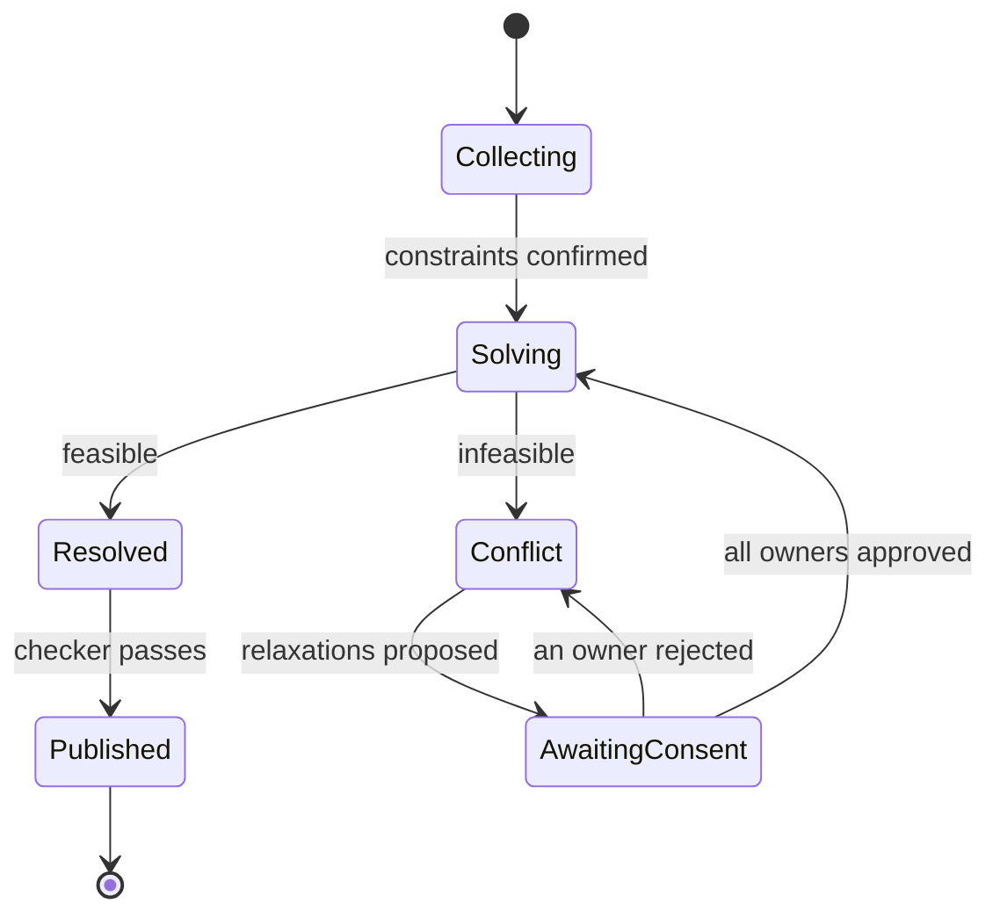
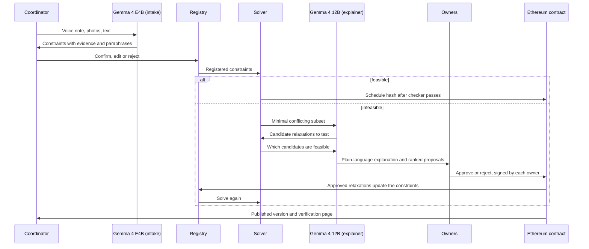

# Sanyojan

**A consent-aware scheduler where Gemma 4 listens, reads and explains, a solver decides, and Ethereum records who agreed.**
Hacktober Fest Open Source AI Hackathon | Track 2: Best Use of Gemma 4

> **One line:** Tell Sanyojan your scheduling rules by voice note, photo, spreadsheet or text. A constraint solver builds a schedule that meets every hard rule. When the rules clash, Gemma 4 explains the clash in plain language, names exactly who is affected, and only those people can approve the fix, which is recorded on Ethereum.

---

## 1. Project Name

**Sanyojan** (Sanskrit/Hindi for "coordination" or "arrangement"): Multimodal, Consent-Aware Scheduling with Gemma 4.

---

## 2. Problem Statement

Timetables, duty rosters, exam invigilation lists and shared-lab bookings are still built by a coordinator juggling spreadsheets. Four problems keep repeating:

1. **The rules are scattered across formats.** Constraints live in WhatsApp voice notes, handwritten availability forms, the photo of last year's timetable, and spreadsheets whose layout differs from one department to the next. Someone has to type or re-map all of it into a tool, and mistakes creep in at that step.
2. **Impossible requests are not explained.** When the rules cannot all be met, a tool reports "no solution" or drops a rule without telling anyone. The output does not say *which* rules clash or *who* owns them.
3. **There is no tamper-proof record of consent.** When a class is moved, disputes follow ("I never agreed to Saturday"). Chat messages and spreadsheet edits can be lost or rewritten, and the coordinator who edits the spreadsheet is also the party whose conduct is disputed.
4. **A language model asked to produce a timetable directly can place classes that violate the stated rules.** Its output has to be checked by a separate program, while a solver produces schedules that meet the hard rules by construction.

On top of this, availability data is personal. People do not want it uploaded to a third-party cloud service.

---

## 3. Project Overview

Sanyojan converts voice, photo and text scheduling input into a verified schedule, and converts every infeasibility into an approval request sent to the owners of the clashing rules.

The design rests on one separation of duties:

| Who | Does what | Never does |
|---|---|---|
| **Gemma 4** | Understands voice, photos and text; writes a parser for each new spreadsheet layout; explains conflicts; proposes fixes in plain language | Place classes in slots, certify that a schedule is valid, or approve changes |
| **Solver (OR-Tools CP-SAT)** | Finds a schedule that meets every hard rule; pinpoints the minimal set of clashing rules; re-checks every proposed fix | Interpret human language |
| **Ethereum smart contract (`ConsentLedger`)** | Stores each constraint's owner and hash; accepts the approval of a relaxation only from that constraint's owner; stores the hash of the published schedule | Hold funds, store personal data, or verify that a schedule is correct |

The flow:

1. **Intake:** a coordinator speaks, uploads photos or screenshots, uploads spreadsheets (.xlsx or .csv), or types. Gemma 4 turns voice, image and text input into structured constraint objects. For a spreadsheet layout it has not seen before, Gemma 4 writes a parser once; the stored parser then produces the constraint objects with no further model call. Each constraint is linked to its source (audio timestamp, image region, text span or spreadsheet cell).
2. **Confirm:** every extracted voice, image and text constraint is shown next to its evidence, with a plain-language paraphrase, and confirmed by a human before it counts. For spreadsheets, a sample is confirmed when a parser is created, and each full file gets a summary review.
3. **Solve:** the solver builds a schedule or reports that none exists.
4. **Explain:** if none exists, the solver returns the minimal conflicting subset of rules. Gemma 4 explains it and proposes ranked relaxations. The solver re-checks that each proposal would actually work.
5. **Consent:** each relaxation goes to the owner of the rule it would change. They approve or reject on-chain.
6. **Publish:** once consent is complete and an independent checker finds zero hard-rule violations, the schedule's hash is published on-chain. Anyone can later verify a timetable file against it.

Everything AI-related runs locally on open weights.

---

## 4. Proposed Solution

| Layer | What it does | Why it exists |
|---|---|---|
| Multimodal intake | Gemma 4 converts voice, images and text into constraint objects via function calling | One model family replaces a separate speech-to-text, OCR and language-model chain |
| Format adapter (parser synthesis) | Gemma 4 writes a Python parser for each new spreadsheet layout, tests it against human-confirmed sample rows, repairs it on failure, and stores it under the layout's fingerprint | Spreadsheet rows are parsed by stored, tested code instead of one model call per row, so token use for a layout is a one-time cost and later files use no model tokens |
| Confirmation screen | Shows each constraint beside its source evidence and a paraphrase | Catches misreadings before they reach the solver |
| Constraint registry | Stores each constraint with an owner, type (hard or soft) and a salted hash | Ownership is what makes consent possible |
| Solver (CP-SAT) | Builds the schedule and guarantees the hard rules | Correctness comes from a solver, not from a language model |
| Conflict extractor | Finds a minimal conflicting subset of rules when no schedule exists | Pinpoints exactly who and what clashes |
| Gemma 4 explainer | Explains the conflict and ranks relaxations in the user's language | Turns solver output into something people can act on |
| Consent contract | Enforces owner-only approval of relaxations and keeps an append-only record of proposals, approvals and published schedule hashes | The party running the scheduler cannot approve on an owner's behalf or edit the history |
| Publisher and verifier | Exports the grid and calendar files; provides a page that hashes an uploaded timetable and compares it with the on-chain value | Verification does not depend on the scheduler's own server |
| Evaluation harness | Measures extraction accuracy, rule violations and explanation quality on gold test sets | Every measurement in Section 16 comes from reproducible scripts |

---

## 5. Objectives

- Accept scheduling rules through **voice, image and text** with one open model family.
- Parse spreadsheet inputs with **stored, tested parsers**, so a given file layout needs a model call only the first time it appears, and later files of that layout use no model tokens.
- Guarantee **zero hard-rule violations** in every published schedule, by construction and by an independent check.
- When a schedule is impossible, **name the exact clashing rules and their owners** and propose fixes that the solver has verified.
- Make every change **consent-based and auditable**: only the owner of a rule can approve relaxing it.
- Keep personal availability data **private**: local inference, and only salted hashes on-chain.
- Run on **modest hardware** (a laptop-class GPU for the small tier).
- Accept mixed **Hindi, Marathi and English** speech, and report extraction accuracy per language.
- Ship a **reproducible evaluation** and publish everything openly under Apache 2.0.

---

## 6. Target Users / Use Case

| User | Need |
|---|---|
| College timetable cells and department coordinators | Build and revise class timetables from scattered inputs |
| Exam cells | Invigilation duties and seating plans with fairness and conflict rules |
| Shared-lab and inter-college resource managers | Booking among parties who do not fully trust one administrator |
| Hostels, NGOs and volunteer groups | Duty rosters collected over chat and voice notes |
| Event organizers (for example hackathons and fests) | Session and room schedules with speaker availability |

**Core use case:** a coordinator dictates the department's rules in Hindi and English, uploads a photo of last year's timetable and the room list, and gets a first verified schedule. When two rules clash, the people who own them receive a plain-language explanation and approve a fix.

---

## 7. Open-Source AI Technology Selected

**Primary model family: Google Gemma 4** (open weights, **Apache 2.0**).

Per the official model card, Gemma 4 comes in five sizes (**E2B, E4B, 12B, 26B A4B, 31B**) with context windows of 128K tokens (E2B, E4B) and 256K tokens (12B, 26B A4B, 31B). All handle text and image input, and audio input is supported on E2B, E4B and 12B. The family offers a built-in thinking mode and native function calling, and supports over 140 languages.

| Role in Sanyojan | Gemma 4 variant | Reason |
|---|---|---|
| **Intake tier:** voice, image and text to constraint objects; clarifying questions | **E4B**, 4-bit quantized | Handles audio, image and text in one model; about 4.5 GB of weights at 4-bit per Google's memory table |
| **Reasoning tier:** conflict explanation and relaxation ranking, with thinking mode for hard cases; parser writing and repair for new spreadsheet layouts | **12B**, or **26B A4B** if hardware allows | Stronger reasoning over the conflicting rules and their context, and code generation for parsers; roughly 6.7 GB (12B) or 14.4 GB (26B A4B) at 4-bit per Google's table |

**Supporting open-source components** (listed in Section 19): Google OR-Tools (CP-SAT) as the solver, Pydantic for schema validation, pandas and openpyxl for reading spreadsheets, a container runtime for the parser sandbox, Foundry and OpenZeppelin for the smart contract, web3.py or ethers.js for chain access, and Streamlit or Gradio for the interface.

*Note: exact checkpoint names, sizes and memory figures will be re-confirmed against the official Gemma 4 model card at the start of the final.*

---

## 8. Why This Technology Was Selected

- **One model family for three input types.** Gemma 4's small models accept audio and images natively. A pipeline of a separate speech recognizer, an OCR engine and a language model passes plain text between stages, so a spoken rule loses its link to the image it refers to. One multimodal model receives both in the same session: it can hear "keep the lab on Monday" and read the Monday column of a timetable photo together.
- **Native function calling.** It lets the model emit schema-valid constraint objects directly, which the solver can consume.
- **Code generation.** Gemma 4's model card lists improved coding benchmarks. The parser-writing step relies on this, and the sandbox and tests check every parser it produces.
- **Token savings from stored parsers.** Per-row extraction sends the schema and one row to the model for every row, so tokens grow with the row count (rows multiplied by prompt tokens plus output tokens). A parser costs one synthesis prompt plus at most three repair rounds, a total that does not depend on how many rows the file has. Later files with the same layout use no model tokens. On local inference this shows up as less GPU time, lower latency and lower energy use; with a hosted model it would also be a lower bill.
- **Thinking mode, used selectively.** Explanations of tangled conflicts benefit from deeper reasoning, so thinking mode is switched on only for those cases.
- **Local and private.** Staff availability and personal constraints stay on the coordinator's machine. Gemma 4's Apache 2.0 license also allows institutions to adopt and modify the system freely.
- **Multilingual.** Coordinators in India routinely mix Hindi, Marathi and English in one sentence. We will measure accuracy per language instead of assuming it.
- **A size ladder that fits one laptop.** A small model handles the high-volume intake and a mid-size model is called only when a conflict needs explaining.

**Why the model does not build the schedule:** hard rules must hold in every output, and a language model gives no such guarantee. The solver produces the schedule. Gemma 4 interprets input and explains conflicts. The evaluation includes an LLM-only baseline, in which Gemma 4 produces the timetable directly, and counts hard-rule violations for both approaches.

---

## 9. AI's Role in the System

Gemma 4 is the **interface between people and the solver**. It converts spoken, photographed and typed input into the solver's constraint format, and converts the solver's conflict output into explanations and proposals.

What the AI does:

1. **Multimodal constraint extraction.** It turns a voice note, a timetable photo, a handwritten or printed availability form, a room list, or typed text into structured constraint objects with a source pointer and a confidence value.
2. **Parser synthesis for spreadsheets.** For each new spreadsheet layout, it writes a Python parser that outputs constraint objects, and rewrites the parser when it fails a test. Once a parser passes, later files with that layout are parsed without a model call.
3. **Clarifying questions.** When something is ambiguous ("not available mornings", but what counts as morning?), it asks instead of guessing.
4. **Paraphrase for confirmation.** It restates each extracted constraint in plain language so a human can catch a misreading.
5. **Conflict explanation.** It explains why a set of rules cannot all hold, naming the people and rules involved, in the user's language.
6. **Relaxation proposals.** It suggests ranked ways to resolve the clash, using the solver's feasibility check as a tool.
7. **Change summaries.** It writes the human-readable summary attached to each published version.

What the AI does **not** do: assign classes to slots, declare a schedule valid, approve any change, submit anything on-chain, or read individual spreadsheet rows once a parser has passed its tests. Those belong to the solver, the independent checker, the stored parser and the people who own the rules.

---

## 10. System Architecture

**Round lifecycle.** The contract records three states: Open (which covers Collecting, Solving, Resolved and Conflict, all of which happen off-chain), AwaitingConsent, and Published.

**Architectural decisions**

| # | Decision | Reason |
|---|---|---|
| AD-1 | The solver is the only component that assigns classes to slots. | Hard rules must hold in every output. Model output is always passed through the solver or the independent checker. |
| AD-2 | Extracted constraints are confirmed by a human before they are registered. Voice, image and text constraints are confirmed one by one against their evidence (audio snippet, image crop or text span). Spreadsheet constraints are confirmed on a sample when a parser is created and by a summary review of each full file, with the source cell shown for any constraint. | A misread rule is caught before it changes a schedule. |
| AD-3 | Approval of a relaxation is enforced by an Ethereum smart contract: only the registered owner address of a constraint can approve or reject changing it. | The party operating the scheduler cannot approve on an owner's behalf or edit the approval history. Specification and justification are in Section 11. |
| AD-4 | Only hashes are written on-chain. Constraint text, names, availability, audio, images and schedules stay off-chain. | Personal availability data is not published. |
| AD-5 | The model process holds no private key and has no tool that calls the contract's approve, reject or publish functions. | Consent actions exist only as transactions signed by people. |
| AD-6 | The consent layer sits behind a five-call interface (register, propose, approve or reject, publish, verify). | The solver, checker and Gemma 4 tiers do not depend on how those five calls are implemented. |
| AD-7 | A spreadsheet layout is parsed by a stored parser. A parser is stored only after it reproduces the human-confirmed sample rows, and a stored parser is never edited; a changed layout gets a new fingerprint and a new parser. | A file layout costs model tokens only when it first appears, and after that the same file always gives the same output. |
| AD-8 | Model-written parser code executes only in a sandbox enforced by the operating system (a container with the network disabled and resource limits), with an import allowlist checked before execution as an additional layer. | Generated code is untrusted until tested, and a static import check alone does not isolate a process. |

---

## 11. Component-Level Architecture

| # | Component | Responsibility | Inputs | Outputs |
|---|---|---|---|---|
| 1 | **Multimodal intake** | Convert audio, images and text into constraint objects via function calling; ask clarifying questions | Voice notes, photos or screenshots, typed text | Draft constraints with source pointers and confidence |
| 1a | **Format adapter (parser synthesis)** | For each new spreadsheet layout, have Gemma 4 write a Python parser, test it against confirmed sample rows, repair it on failure (at most 3 attempts), store it under the layout's fingerprint, and run stored parsers in the sandbox | .xlsx or .csv file; confirmed sample rows | Constraint objects with spreadsheet-cell sources; a parser registry entry |
| 2 | **Confirmation screen** | Show each voice, image and text constraint next to its evidence (audio snippet, image crop, or text span) and a paraphrase; accept, edit or reject. For parsed spreadsheets, show the sample rows when a parser is created and a summary (counts per constraint type, the first 10 parsed rows, every skipped row) for each full file | Draft constraints | Confirmed constraints |
| 3 | **Constraint registry** | Assign each constraint an owner, a hard or soft type, and a salted hash | Confirmed constraints | Registered constraints |
| 4 | **Solver** | Build a schedule satisfying all hard rules while minimizing soft-rule penalties | Registered constraints | Schedule, or "infeasible" |
| 5 | **Conflict extractor** | Find a minimal set of rules that cannot hold together, using solver assumptions plus deletion-based shrinking | Infeasible model | Minimal conflicting subset and its owners |
| 6 | **Explainer and relaxation proposer** | Explain the conflict; generate relaxation candidates; call the solver to test each | Conflicting subset with source evidence | Explanation and verified, ranked proposals |
| 7 | **Consent contract** | Enforce owner-only approval; block publication while any proposal is pending; record every action as an event | Proposals; transactions signed by constraint owners and by the coordinator account | Event log, current constraint hashes, published schedule hashes |
| 8 | **Independent checker** | A small, separate script that re-verifies every hard rule against the final schedule | Schedule and constraints | Pass or fail with a list of violations |
| 9 | **Publisher and verifier** | Export grid image, calendar files and a page where anyone can check a file's hash against the chain | Final schedule | Outputs and verification result |
| 10 | **Evaluation harness** | Reproducible scoring of extraction, solving and explanation | Gold test sets | Metrics and ablation report |

**Constraint object (fields):** identifier, owner, hard or soft, type, parameters, penalty weight (for soft rules), source (modality plus pointer such as audio timestamp, image region, text span or spreadsheet cell), extraction confidence, and plain-language paraphrase.

**Initial constraint types:** unavailability of a person or room at given slots; limits on classes per day or in a row; required consecutive slots (for labs); room capacity or type requirements; pinned (fixed) assignments; no double-booking of a person, room or student group; spread rules (for example, the same subject not twice in a day); required breaks; and soft preferences (for example, morning slots).

**What each input type handles:**

| Input | Typical content | Evidence kept for confirmation |
|---|---|---|
| Voice | "Rao sir Monday ko available nahi hain", dictated rules, answers to clarifying questions | Audio snippet with timestamp |
| Photo or screenshot | Last year's timetable, handwritten or printed availability forms, room lists | Image crop of the exact region read |
| Text | Typed rules, pasted messages, edits | The text span |
| Spreadsheet or CSV | Faculty workload sheets, room lists, ERP exports, last year's timetable as a sheet | Sheet name, row and column of the source cell |

**Format adapter: parser synthesis and registry**

*Scope:* .xlsx and .csv inputs. PDF tables are listed under future scope (Section 18).

*Layout fingerprint:* a hash of the sheet names plus the normalized header row of each sheet (lower-cased, whitespace collapsed). Files with the same fingerprint use the same stored parser.

*Synthesis loop (reasoning-tier Gemma 4):*
1. The model receives the header row, up to 10 sample rows, the constraint schema (types and fields above), and the output contract: a function that takes the file path and returns a list of constraint objects as JSON, each carrying the sheet, row and column of its source cell.
2. Gemma 4 writes the parser, and the sandbox runs it on the sample rows.
3. A person reviews the parsed sample on the confirmation screen and corrects any wrong rows. The corrected rows become the test cases.
4. Automatic tests: (a) the parser output equals the confirmed rows; (b) every output object validates against the Pydantic schema; (c) every output object has a source cell; (d) no non-empty source row is dropped, since each is either converted to at least one constraint object or listed as skipped with a reason.
5. On a failed test, Gemma 4 receives the test report and the difference from the confirmed rows, and rewrites the parser. There are at most 3 repair attempts. After that, the file falls back to per-row extraction by the intake tier and is flagged for manual review.
6. A parser that passes is stored in the registry with its fingerprint, source code, source hash, confirmed test rows, and the name and version of the model that wrote it.

*Owner labels:* a parser outputs an owner label for each constraint, such as the faculty name in a column. The coordinator maintains a table that maps owner labels to Ethereum addresses, and the table is used when constraints are registered on the contract.

*Running a stored parser:* the sandbox executes it on the full file. The result goes to the confirmation screen as a summary: counts per constraint type, the first 10 parsed rows, and every skipped row. The source cell is shown for any constraint on request.

*Token use:* per-row extraction costs, for each row, the prompt tokens (schema plus row) and the output tokens, so it grows with the row count. Synthesis costs one prompt (header row, up to 10 sample rows, schema) and the generated code, plus up to 3 repair rounds (test report and rewritten code). This total does not depend on the number of rows. A stored parser uses no model tokens. The evaluation harness logs input and output tokens for every model call, so both paths can be compared on the same file.

*Layout drift:* a file with a new fingerprint triggers synthesis. For a known fingerprint, if more than 5% of non-empty rows are skipped (a configurable default), the file is flagged and sent back to synthesis.

*Sandbox:* each parser runs in a separate process inside a container with the network disabled; read-only access to the one uploaded file; limits on CPU time, memory and wall-clock time; and JSON on standard output as the only output channel. Before execution, a static check rejects any import outside the allowlist (pandas, openpyxl, re, datetime, json). The container provides the isolation, and the import check is an additional layer.

**Blockchain layer: `ConsentLedger` (Ethereum, local or test network only)**

**What it does**

One Solidity contract, `ConsentLedger`, performs five functions and nothing else:

1. **Registers constraint ownership.** For each confirmed constraint it stores the owner's Ethereum address and the constraint's current hash.
2. **Enforces owner-only approval.** A relaxation of a constraint can be approved or rejected only by a transaction signed by that constraint's owner address. The contract reverts a call from any other address, including the coordinator's.
3. **Blocks publication while consent is pending.** A schedule version can be published only when its round has no pending proposals.
4. **Keeps an append-only history.** Every registration, proposal, approval, rejection and publication is a timestamped event that cannot be edited or removed afterwards.
5. **Answers verification queries.** A read-only call takes a schedule hash and returns whether it was published, in which round, and when.

| Function | Caller | Precondition | Effect |
|---|---|---|---|
| `registerConstraint(owner, contentHash)` | Admin (coordinator account) | None | Creates a constraint record: owner address, current hash, status Active. Emits `ConstraintRegistered`. |
| `openRound()` | Admin | None | Creates a round in state Open. |
| `proposeRelaxation(roundId, constraintId, newContentHash, explanationHash)` | Admin | Round is Open or AwaitingConsent; constraint is Active | Creates a Pending proposal and stores the hash of Gemma 4's explanation text. Round becomes AwaitingConsent. Emits `RelaxationProposed`. |
| `approveRelaxation(proposalId)` | **Constraint owner only** | Proposal is Pending | Marks the proposal Approved and replaces the constraint's current hash with `newContentHash`. If no other proposal is Pending, the round returns to Open. Emits `RelaxationApproved`. |
| `rejectRelaxation(proposalId)` | **Constraint owner only** | Proposal is Pending | Marks the proposal Rejected; the constraint is unchanged. If no other proposal is Pending, the round returns to Open. Emits `RelaxationRejected`. |
| `publishSchedule(roundId, scheduleHash, constraintSetHash, summaryHash)` | Admin | Round is Open with zero Pending proposals | Stores the three hashes and `block.timestamp`; round becomes Published. Emits `SchedulePublished`. |
| `getConstraint(constraintId)` (read-only) | Anyone | None | Returns owner address, current hash and status. |
| `getPublication(scheduleHash)` (read-only) | Anyone | None | Returns round id, constraint-set hash, summary hash and timestamp, or "not published". |

**What is hashed (keccak256):**
- *Constraint hash:* canonical JSON of the constraint plus a random 32-byte salt per constraint. The salt stays off-chain with the owner and the app. Constraint wording such as "unavailable on Monday" has very few possible values, so an unsalted hash could be matched by trying them all; the salt prevents that.
- *Explanation and change-summary hashes:* the UTF-8 text produced by Gemma 4.
- *Schedule hash:* the canonical schedule file (CSV with fixed column order and fixed row order).
- *Constraint-set hash:* the current constraint hashes concatenated in constraint-id order. Anyone can recompute it from `getConstraint` calls.

**What is not on-chain:** names, availability details, constraint text, source audio and images, schedule contents, and explanation text.

**Deployment:** a local Foundry (Anvil) chain with pre-funded test accounts (one admin account plus one account per demo owner) is the demo environment. A Sepolia deployment with test ETH is optional. There is no mainnet deployment, the contract has no payable functions, and it holds no funds.

**Why it is required**

The scheduler needs approvals that the party running it can neither forge nor erase. The coordinator who operates the scheduler is also the party whose conduct is disputed ("you moved my class without asking"). Three properties follow, and a database or log file operated by the coordinator does not provide them:

1. **Authorization the coordinator does not control.** `approveRelaxation` reverts unless the sender is the registered owner. In a coordinator-operated database, the coordinator, or anyone with database access, can write an approval on an owner's behalf.
2. **History the coordinator cannot rewrite.** Each approval, rejection and publication is a timestamped transaction on a network where past blocks cannot be edited or deleted by the coordinator. A database administrator can edit or delete rows.
3. **Verification that does not rely on the scheduler's server.** To check a timetable file, anyone hashes it and calls `getPublication` on a public node, with no account and no access to the scheduler. The result does not depend on the scheduler's server being online or honest.

These properties matter where the owners of constraints belong to different institutions or departments and none of them operates the scheduling system: shared labs and halls, exam seating and invigilation across colleges, and multi-department resource booking.

**Scope limits:** the contract does not choose schedules and does not verify correctness; the solver and the independent checker do. The admin account can publish any hash, so a party who holds the schedule file and the constraint set runs the checker on them, and confirms that the constraint-set hash equals the value recomputed from `getConstraint`.

---

## 12. Data / Information Flow

**Per-stage data transformation:**

| Stage | Example content |
|---|---|
| Raw input | Audio of a spoken rule; a photo of a timetable; a typed line; a spreadsheet file |
| Draft constraint | Type, parameters, owner, source pointer, confidence, paraphrase |
| Confirmed constraint | Same fields, now human-approved |
| Registered constraint | Adds a salted hash and an owner address |
| Solver result | A schedule, or a minimal conflicting subset |
| Explanation and proposals | Plain-language text plus a solver-verified feasibility flag per proposal |
| On-chain record | Hashes of constraint set, proposals, approvals, schedule and summary |
| Published outputs | Grid image, calendar files, verification page |

**Illustrative example** (names are fictional):

- A coordinator says in Hinglish: "Rao sir Monday ko available nahi hain. Section A ka DBMS lab Monday ko hi rakhna hai." A photo of last year's timetable is uploaded as well, together with the department's faculty workload sheet (.xlsx).
- Three relevant rules are extracted: (C1) Prof. Rao is unavailable on Mondays, owned by Prof. Rao; (C2) Section A's DBMS lab is pinned to Monday, owned by Section A's coordinator; (C3) only Prof. Rao is assigned to teach that lab, owned by the department admin. C1 and C2 come from the voice note, and each appears on the confirmation screen beside its evidence. C3 comes from the workload sheet (sheet "Workload", row 14, column D). That sheet's layout has not been seen before, so Gemma 4 writes a parser for it; the parser passes its tests on the confirmed sample rows and is stored. The next file with the same layout is parsed without a model call.
- The solver reports the model infeasible and returns {C1, C2, C3} as the minimal conflicting subset.
- Gemma 4 explains: "Section A's lab must be on Monday, only Prof. Rao teaches it, and Prof. Rao is unavailable on Mondays." It proposes two fixes: (R1) move Section A's lab to Tuesday, which needs approval from the owner of C2; or (R2) allow a second qualified teacher for the lab, which needs approval from the owner of C3. The solver confirms both are feasible and reports the soft-rule cost of each.
- Only the named owner approves their proposal on-chain. Once approved, the solver re-runs, the checker passes, and the schedule hash is published.

---

## 13. Agentic Workflow

Sanyojan uses a small, **bounded** agentic loop that keeps people in control.

1. **Extract:** the intake model proposes constraints and asks clarifying questions when something is ambiguous.
2. **Confirm:** a human accepts, edits or rejects each constraint.
3. **Solve and diagnose:** the solver builds a schedule, or returns the minimal conflicting subset.
4. **Explain and propose:** the reasoning-tier model explains the conflict and generates relaxation candidates. It calls the solver to test each one.
5. **Consent:** each affected owner signs an `approveRelaxation` or `rejectRelaxation` transaction on the contract. A rejection returns the loop to step 4 with that option excluded.
6. **Repeat, then stop:** at most three relaxation rounds per conflict. If still unresolved, the system reports the situation to the coordinator for a manual decision.

**Tools the model may call (via function calling):** add a draft constraint, ask a clarifying question, fetch conflict details, test a relaxation with the solver, write a change summary, submit parser source for sandbox testing, and read the resulting test report.

**Parser loop (spreadsheets):** (1) Gemma 4 writes a parser from the header row, sample rows and the constraint schema; (2) the sandbox runs it on the sample; (3) a person corrects the parsed sample, and the corrected rows become the tests; (4) on a failed test, Gemma 4 reads the test report and rewrites the parser, at most 3 attempts; (5) a parser that passes is stored under the layout fingerprint, and a file whose parser cannot be repaired falls back to per-row extraction and is flagged for manual review. Model-written code executes only inside the sandbox described in Section 11.

**Guardrails:** the model process holds no private key and has no tool that calls approve, reject or publish. Those contract calls are transactions signed by the constraint owners (approve, reject) and by the coordinator account (propose, publish). Every model-proposed relaxation is re-solved before anyone sees it, and proposals that remain infeasible are discarded.

---

## 14. Technology Stack

| Area | Choice |
|---|---|
| AI models | Gemma 4 E4B (intake), Gemma 4 12B or 26B A4B (explanation) |
| Local inference | Ollama, llama.cpp or vLLM, whichever supports Gemma 4 audio and image input best in the final environment |
| Structured output | Native function calling plus Pydantic schema validation |
| Solver | Google OR-Tools CP-SAT (assumption-based infeasibility analysis) |
| Spreadsheets and parser sandbox | pandas and openpyxl for reading files; parsers run as a separate process in a container with the network disabled and CPU, memory and time limits; static import check before execution; parser registry stored as files keyed by layout fingerprint |
| Smart contract | One Solidity 0.8.x contract (`ConsentLedger`); Foundry for tests and a local Anvil chain; OpenZeppelin AccessControl for the admin role |
| Chain access | web3.py or ethers.js |
| Network | Local Foundry (Anvil) chain with pre-funded test accounts for the demo; optional Sepolia deployment with test ETH. No mainnet, no real funds |
| Interface | Streamlit or Gradio, with audio recording and image upload |
| Outputs | Timetable grid image, calendar (ICS) files, verification page |
| Evaluation | Python scripts, scikit-learn, matplotlib |
| Packaging | Docker, pinned dependencies, fixed random seeds |
| Version control and license | Public GitHub repository, Apache 2.0 |

---

## 15. Expected Features

- **Voice, photo and text intake** through one Gemma 4 model family.
- **Parser synthesis for spreadsheets:** a layout needs a model call the first time it appears. Later files with the same layout are parsed by the stored, tested parser and use no model tokens, with the source cell shown for each constraint.
- **Evidence-linked confirmation:** every extracted rule appears beside the audio snippet, image crop, text span or spreadsheet cell it came from.
- **Paraphrase check:** each rule is restated in plain language before it is accepted.
- **Verified schedules:** zero hard-rule violations, confirmed by an independent checker.
- **Exact conflict diagnosis:** the minimal set of clashing rules and the people who own them.
- **Solver-verified fixes:** ranked relaxation proposals that are guaranteed workable.
- **Consent log on Ethereum:** only the owner of a rule can approve relaxing it.
- **Verification page:** upload a timetable file and see whether it matches the on-chain version.
- **Multilingual explanations:** in the language the user chooses, within measured limits.
- **Calendar export** for faculty and student groups.
- **Reproducible evaluation** with ablations.

---

## 16. Implementation Approach

The PS says implementation happens in the final hackathon, so work is organized in tiers. Each module is independent, so any one can slip without breaking the core loop.

**Tier 1: working core (must have)**
1. Constraint schema and registry.
2. Text intake with Gemma 4 E4B and the confirmation screen.
3. CP-SAT solver, independent checker and timetable grid output.
4. Conflict extractor and the Gemma 4 explanation with solver-verified relaxations.
5. Evaluation harness with a first test set.

**Tier 2: multimodal intake and consent layer (should have)**
6. Voice intake using Gemma 4 audio input.
7. Image intake for timetable photos, availability forms and room lists.
8. Format adapter: parser synthesis, sandbox and parser registry for spreadsheet inputs.
9. Consent contract with tests, local chain, and the owner-approval flow.
10. Verification page.

**Tier 3: polish (nice to have)**
11. Sepolia testnet deployment.
12. Hindi and Marathi explanations; calendar export.
13. Ablation report and a polished demo script.

**How we will evaluate** (all numbers will be measured and reported, none are assumed here):

| What | How |
|---|---|
| Constraint extraction accuracy | A gold set of constraints written by us and expressed as typed text, spoken audio (including Hindi-English mixes) and photographed forms; report precision, recall and field-level accuracy per modality and per language |
| Parser synthesis | A set of spreadsheet layouts we create (different header names, merged cells, one rule per row, one rule per column, mixed-language headers), each with a fully hand-checked file. Report: share of layouts whose parser passes its tests within 3 attempts; repair attempts needed; exact-match rate of parsed rows against the hand-checked file; wrong rows that the tests did not catch; model calls for the first file of a layout and for later files of the same layout; identical output across repeated runs of the same file; input and output tokens per file for the parser path and for per-row extraction, plotted against row count, and the row count above which synthesis uses fewer tokens than per-row extraction |
| Schedule validity | Independent checker on every output; also compare against an **LLM-only baseline** where Gemma 4 is asked to produce the timetable directly, counting rule violations |
| Conflict diagnosis | Whether the rules cited in the explanation match the solver's minimal conflicting subset; human rating of clarity on a small panel |
| Proposal quality | Share of proposals that are feasible, with and without solver verification |
| Contract behavior | Foundry tests: a non-owner calling approve or reject reverts; a non-admin calling register or publish reverts; publish reverts while a proposal is Pending; a second approval of the same proposal reverts; approval updates the stored constraint hash; events carry the expected arguments; the view call returns publication data only for published hashes; gas per function is recorded |
| Efficiency | Time per stage, memory use on the target hardware, and input and output tokens per model call for each stage |
| Ablations | Remove the confirmation step, remove voice, remove image, remove solver verification, replace stored parsers with per-row Gemma 4 extraction, and report the change in accuracy, time and model calls |

---

## 17. Expected Final Output

1. A **working web app** that accepts voice notes, images, spreadsheets and text and produces a verified schedule. Spreadsheet layouts are handled by parsers that Gemma 4 wrote, the sandbox tested and a registry stores.
2. A **conflict view** showing the clashing rules, their owners, Gemma 4's explanation and the ranked, solver-verified fixes.
3. A **smart contract** with tests, deployed to a local chain (and optionally Sepolia), plus a live view of the consent log.
4. A **verification page** that checks any timetable file against the on-chain record.
5. **Exports:** timetable grid image and calendar files.
6. A **reproducible evaluation report** with the LLM-only baseline and the ablations.
7. A **public GitHub repository** under Apache 2.0 with setup instructions.

---

## 18. Future Scope / Scalability

- **Shared institutions:** one consent ledger across departments or colleges for shared labs, halls and exam resources.
- **Gasless approvals:** an added `approveRelaxationBySig` function that verifies the owner's EIP-712 signature, so the app can relay the transaction and owners need no cryptocurrency or fees.
- **Privacy-preserving proofs:** zero-knowledge proofs that a schedule satisfies everyone's rules without revealing private availability.
- **Fairness reporting:** show how soft-rule costs are distributed across people and flag persistent imbalance.
- **More domains:** hospital-style duty rosters, volunteer shifts and event programmes, using the same constraint schema.
- **More file formats for parser synthesis:** PDF tables with a text layer, using the same synthesis loop with a PDF table extractor.
- **Mobile and offline:** the small Gemma 4 tier supports an on-premise or offline deployment.
- **Learning from corrections:** coordinator edits become examples for improving extraction on a department's own phrasing.
- **Larger models and longer inputs:** use the long context of the bigger Gemma 4 sizes to read full rule documents and circulars.

---

## 19. Open-Source Dependencies / Components

| Component | Purpose | License type |
|---|---|---|
| Gemma 4 (E4B, 12B, 26B A4B) | Intake and explanation tiers | Apache 2.0 |
| Ollama, llama.cpp or vLLM (one chosen at build time) | Local inference | MIT, MIT, Apache 2.0 |
| Google OR-Tools | CP-SAT solver | Apache 2.0 |
| Pydantic | Constraint and output schema validation | MIT |
| pandas, openpyxl | Reading spreadsheets; used inside parsers | BSD / MIT |
| Docker Engine (or an equivalent container runtime) | Parser sandbox | Apache 2.0 |
| Foundry | Contract tests and local chain | MIT / Apache 2.0 |
| OpenZeppelin Contracts | Access control | MIT |
| Solidity compiler (solc) | Compiling the contract | GPL-3.0 |
| web3.py or ethers.js | Chain access | MIT |
| Streamlit or Gradio | Interface | Apache 2.0 |
| scikit-learn, matplotlib | Metrics and plots | BSD / PSF-style |

*License types are listed to the best of our knowledge and will be re-verified when dependencies are pinned in the final.*

---

## 20. Expected Challenges and Mitigation

| Challenge | Risk | Mitigation |
|---|---|---|
| **Misread rules from voice or photos** | A wrong constraint silently changes the schedule | Evidence-linked confirmation, plain-language paraphrases, confidence flags and clarifying questions; measure per-modality accuracy |
| **Handwriting and low-quality photos** | Unreliable extraction | Ask for a clearer photo or a typed correction; mark low-confidence fields; report accuracy per modality |
| **Hindi and Marathi speech accuracy is not yet measured** | Poor extraction from spoken Hindi or Marathi | Measure per language on the gold set; route low-confidence speech to typed confirmation; report the results |
| **Model-written code runs on the coordinator's machine** | A faulty parser could read other files, use the network or exhaust resources | Parsers run only in the sandbox: separate process in a container with the network disabled, read-only access to the one uploaded file, CPU, memory and time limits, JSON on standard output as the only output. A static import check runs before execution as an additional layer; the container provides the isolation |
| **A parser passes its tests but misreads other rows** | Wrong constraints enter the schedule | Tests use human-confirmed sample rows; every skipped row is listed; each full file gets a summary review (counts per type, first 10 rows, skipped rows); the source cell is shown for any constraint; the evaluation counts wrong rows the tests did not catch |
| **A layout changes after its parser is stored** | The stored parser produces wrong output on the changed file | The fingerprint covers sheet names and the header row, so a changed header gives a new fingerprint and triggers synthesis; for a known fingerprint, more than 5% skipped non-empty rows (configurable default) flags the file and sends it back to synthesis |
| **A parser cannot be repaired within 3 attempts** | The layout cannot be handled by code | Fall back to per-row extraction by the intake tier, flag the file, and show the failing test report to the coordinator |
| **Model mis-formalizes a rule** | The solver optimizes the wrong thing | Schema validation, paraphrase round-trip check, and human confirmation before any rule counts |
| **Model proposes an unworkable fix** | Owners are asked to approve something that fails | Every proposal is re-checked by the solver before anyone sees it |
| **Large conflicts are hard to read** | Explanations become long or confusing | Minimal conflicting subsets only; show the three most useful fixes |
| **Admin account can publish an arbitrary hash** | A published hash may not correspond to a valid schedule | Parties run the independent checker on the schedule file and the constraint set they hold; the constraint-set hash must equal the value recomputed from the contract's stored constraint hashes |
| **Owners without wallets or fees** | An owner cannot sign an approval | The demo uses one pre-funded test account per owner; signed-message (EIP-712) approvals relayed by the app are the planned extension (Section 18) |
| **Testnet faucets unreliable** | Demo depends on an outside service | Local Foundry chain is the primary demo; Sepolia is optional |
| **Contract bugs** | The wrong address could approve or publish | OpenZeppelin AccessControl, the Foundry tests listed in Section 16, no payable functions, local or test network only, and a "not audited" notice in the repository |
| **Personal data exposure** | Availability patterns leak | Local inference; only hashes on-chain; a random 32-byte salt per constraint, kept off-chain |
| **Hackathon time limit** | Over-scoping | Tiered plan; the core loop works without voice, image, the parser module or the contract |
| **Hardware limits** | Larger tiers do not fit | The E4B intake tier alone runs on a laptop-class GPU; the explanation tier can run quantized or on the smaller 12B |

---

*Team details, contact information and the license file will be added to the repository metadata. This repository intentionally contains only this README, per the qualifier rules.*
# PhishTank
