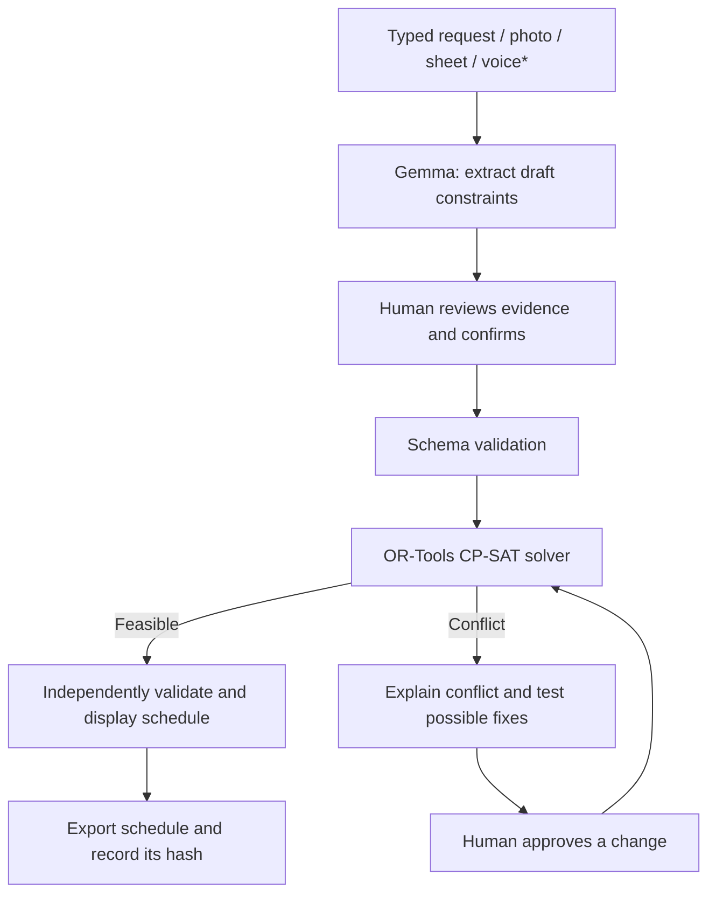

# GeCompose
### On-Device Gemma + Solver-Verified Scheduling

**Team:** PhishTank  
**Track:** Best Use of Gemma / Open-Source AI  
**Status:** Prototype planned / in development

GeCompose turns scattered scheduling instructions—typed notes, timetable photos, voice notes, and spreadsheets—into reviewable rules, then creates and verifies schedules using a mathematical solver. Its key idea is simple: **AI understands the request; the solver checks the schedule; people approve important changes.**

## The Problem

College timetable and event coordinators often receive availability in different formats. Manual entry causes errors, ordinary AI can invent or double-book slots, and schedule changes may lack a clear approval record.

## How It Works

*Start with typed text. Add photos, audio, and spreadsheet formats only when the selected model and runtime support them reliably.

## On-Device Gemma App

Build **GeCompose Local Intake Companion** as the first small app:

1. Enter a request, e.g. “Prof. Rao is unavailable Monday morning.”
2. Run a compatible Gemma model locally and convert the request into a structured JSON draft.
3. Show the extracted rule and any missing or ambiguous details.
4. Let the user edit and confirm the draft.
5. Validate the data before sending it to the local Python scheduling service.

The AI output is never trusted automatically. Invalid or unconfirmed data must not reach the solver.

## Technology Stack

- **AI:** A compatible open-weight Gemma model
- **On-device inference:** Google AI Edge / LiteRT-LM or a supported MediaPipe path
- **App UI:** Android (Kotlin) for a mobile prototype; Streamlit can provide the quickest desktop demo
- **Validation:** JSON schema and Pydantic
- **Scheduling:** Python + Google OR-Tools CP-SAT
- **Data:** SQLite for local rules and records
- **Optional parser isolation:** Docker with network access disabled and strict resource limits
- **Optional consent/audit demo:** Solidity + Foundry/Anvil; store hashes, not private availability data

Choose the model and runtime only after checking current device compatibility. Do not claim every model runs on every phone or that the system is fully offline until tested.

## Build Order for the Hackathon

1. **Working baseline:** Create sample teachers, rooms, time slots, and constraints.
2. **Solver first:** Generate a timetable and reject teacher/room overlaps; add tests for valid and impossible cases.
3. **Gemma intake:** Convert typed requests to strict JSON and validate the schema.
4. **Human review UI:** Show the AI draft, allow edits, and require explicit confirmation.
5. **Conflict demo:** Show why a constraint set is infeasible and offer only fixes that pass a solver re-check.
6. **Proof and polish:** Export the schedule; if time permits, record its hash and a test approval on a local blockchain.

**Priority:** A reliable end-to-end demo is better than several unfinished integrations. Treat spreadsheet code generation, multimodal intake, and blockchain consent as optional extensions if the core workflow is not stable.

## Demo Scenario

- Rule 1: Prof. Rao is unavailable Monday morning.
- Rule 2: Database Lab is fixed to Monday morning.
- Rule 3: Prof. Rao is the only eligible instructor.

The solver should report that these rules cannot all be satisfied. GeCompose explains the conflict, proposes a candidate change, checks it with the solver, and requires human confirmation before re-solving.

## What Makes GeCompose Different

- **Grounded scheduling:** OR-Tools, not the language model, determines whether a schedule satisfies the constraints.
- **Human control:** Every extracted rule is reviewed before use; consequential changes require approval.
- **Local-first design:** Keep source files and personal availability local where the selected runtime permits it.
- **Explainable failure:** Show conflicting rules instead of returning only “no solution.”
- **Auditable output:** A schedule hash can help detect later changes; a hash alone does not prove that the original schedule was correct.

## Success Checklist

- [ ] A typed request becomes a schema-valid draft.
- [ ] The user can review and confirm or edit it.
- [ ] The solver creates a schedule that passes an independent checker.
- [ ] An impossible test case displays a useful conflict explanation.
- [ ] No unconfirmed AI output reaches the solver.
- [ ] Offline behavior and device performance are tested before making privacy or performance claims.
- [ ] Optional blockchain demo records approval/hash events without exposing personal data.

## Learning Resources

- [Gemma models](https://ai.google.dev/gemma)
- [Google AI Edge](https://ai.google.dev/edge)
- [Google OR-Tools](https://developers.google.com/optimization)
- [Pydantic](https://docs.pydantic.dev/)
- [Foundry](https://book.getfoundry.sh/)

---

**One-line pitch:** GeCompose converts messy human scheduling requests into explainable, solver-verified timetables, with human-approved changes and an optional tamper-evident audit trail.
